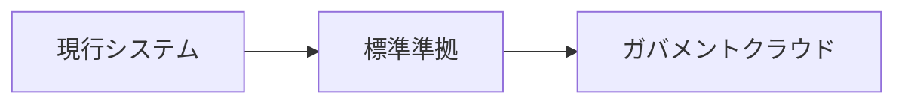

# /gc-article — GovCloud Insight SEO記事自動生成

ガバメントクラウド・自治体標準化テーマのSEO記事を自動生成し、`content/articles/` に保存してVercelにデプロイします。

## 使い方

```
/gc-article ガバメントクラウドとOCIの違い
/gc-article KW: 自治体 標準化 2026年問題
/gc-article 移行期限に間に合わない自治体はどうなる？
```

## 実行フロー

### Step 0: KWプランナー参照（情報源の事前把握）

KWプランナー（`$GDRIVE_WORKSPACE/contents/PJ19/gcportal_kw_planner_v9_20260331.xlsx`）を確認し、該当KWの行から以下を取得:
- **第12列「情報源」**: 記事の主要参照先（`デジ庁RAG`, `X+Web`, `Web` 等）
- **第17列「note有料ネタ」**: 記事の差別化ポイント・切り口
- KWプランナーに記載がない場合は、最も関連性の高いKW行を参考にする

### Step 1: KW調査 & RAG検索（一次情報の確保）

1. **WebSearch** で検索意図・競合記事を分析（上位5記事の構成を把握）
2. **デジ庁RAG検索** でファクトを収集（**最低3クエリ実行が必須**）:
   ```bash
   cd ~/workspace/pj/digital-go-jp-rag && source .venv/bin/activate
   python 04_search.py "メインKW"
   python 04_search.py "関連概念・制度名"
   python 04_search.py "数値データ・統計クエリ"
   ```
   クエリ設計のコツ:
   - 1つ目: メインKWそのまま（概要把握）
   - 2つ目: 制度名・法令名・事業名で絞り込み（正確なファクト）
   - 3つ目: 数値・統計・金額に特化（データドリブンの根拠）
3. RAG結果から引用可能なデータポイント・出典URLを抽出
4. **最低3件のRAG出典を本文に組み込むこと**（これが競合記事との差別化の核）
   - RAG出典がない記事は価値が低い。一次情報（デジ庁公式資料・総務省データ等）が信頼性の源泉
   - RAG結果が薄い場合は追加クエリで補完する

### Step 2: 構成案

1. **検索意図に応じた文字数を決定**:
   - 情報収集（「〜とは」「違い」「一覧」）→ 3,000〜5,000字
   - 課題解決（「方法」「対処」「ガイド」）→ 4,000〜7,000字
   - 比較検討（「比較」「選び方」「コスト」）→ 5,000〜8,000字
2. H2/H3構成を設計
3. **内部リンク設計**（必須）:
   - 本文中にピラーページへの自然なリンク（最低2箇所）
   - 同クラスターの既存記事へのクロスリンク
   - 記事末尾のCTAは `ArticleCTA` コンポーネントが自動挿入するためMarkdown側では不要

### Step 3: 本文執筆

- **ですます調** / データドリブン / 一次情報ベース
- 引用ルール: `ref_digital-go-jp-rag.md` に準拠（PDFは元URL記載）

#### 出典ルール（必須・信頼性の核）

**本文中の出典表記**（インライン）:
- データ・数値を引用するたびに直後に出典を明記
- フォーマット: `（出典：[組織名 資料名](URL)、YYYY年MM月）`
- URL がある場合は必ずリンクにする
- 例: `（出典：[デジタル庁 地方公共団体の基幹業務システムの統一・標準化](https://www.digital.go.jp/policies/local_governments)、2025年12月）`

**記事末尾の出典一覧セクション**（必須）:
記事の最後に `## 参考資料・出典` セクションを設け、全出典をリスト化する。

```markdown
## 参考資料・出典

1. デジタル庁「地方公共団体の基幹業務システムの統一・標準化」
   [https://www.digital.go.jp/policies/local_governments](https://www.digital.go.jp/policies/local_governments)
2. 総務省「自治体DX推進計画」（2025年3月改定）
   [https://www.soumu.go.jp/...](https://www.soumu.go.jp/...)
3. 内閣官房 デジタル行財政改革 共通ワーキングチーム 第3回資料（2025年4月）
   [https://www.cas.go.jp/...](https://www.cas.go.jp/...)
```

出典の優先順位:
1. **デジ庁RAG** から得た公式資料（最も信頼性が高い）
2. **総務省・内閣官房** の公表資料
3. **地方自治体** の公表データ（都道府県・政令市）
4. **日経・専門メディア** の報道（補助的に使用）

#### 引用品質ルール（Layer分類）

記事の引用元は信頼性に応じて3層に分類する。**E-E-A-T（専門性・権威性・信頼性）を維持するために必ず遵守すること。**

| Layer | 扱い | 引用時の記法 | 対象例 |
|-------|------|-------------|--------|
| **L1: 必須引用** | 政府公式の一次情報。記事の根拠として最優先で使用 | `（出典：[組織名 資料名](URL)、YYYY年MM月）` | デジタル庁政策ページ・PDF、総務省ガイドライン・ポータル、GCAS利用ガイド |
| **L2: 推奨引用** | CSP公式ブログ・技術解説。**「ベンダー視点」と明記**して引用 | `（○○社公式ブログによると、...）` | AWS/GCP/Azure/Oracle公式ブログ、G-gen等の認定パートナー技術ブログ |
| **L3: 引用非推奨** | 二次メディア・個人ブログ。原則として引用しない | 使用する場合は `（○○社発表によると、...）` 形式のみ | PR TIMES、ASCII.jp、note個人記事 |

**禁止事項**:
- L3の個人ブログ（note等）をファクトの根拠として引用してはならない（E-E-A-T毀損）
- L2のCSPブログを中立的事実として引用してはならない（必ずベンダー視点を明示）
- PR TIMESの情報は「○○社発表によると」形式以外で使用してはならない

#### 図解ルール（必須・シンプル原則）

**全記事に最低1つのMermaid図を含めること。** 図解は滞在時間を伸ばしSEO評価を高める。

**シンプル原則**: ノード数は**最大6〜8個**。一目で構造が分かることが最優先。複雑な図は読者を混乱させるだけ。

推奨パターン（全て `flowchart` で統一）:

```markdown

```

図解の配置:
- **記事の冒頭付近に1つ**: 記事全体の要約・構造を俯瞰する図
- **最低1つ、多くても2つ**（入れすぎない）

やってはいけないこと:
- ノード10個以上の複雑な図
- 色・スタイル指定（デフォルトテーマに任せる）
- mindmap, timeline等（`flowchart` に統一。レンダリング互換のため）

Markdown比較表も有効:
```markdown
| 項目 | 移行前 | 移行後 | 変化率 |
|------|--------|--------|--------|
| 年間運用費 | 1.2億円 | 4.8億円 | +300% |
```

### Step 4: アイキャッチ画像生成

**HTML + Playwright スクリプトで生成**（統一フォーマット）:

```bash
cd ~/workspace/pj/PJ19_GCInsight/gcportal
export $(grep -v '^#' .env.local | xargs)
node scripts/generate-cover-images.mjs {slug}
```

- DBから記事データ（title, tags）を読むので **必ず Step 7.5（DB投入）の後に実行**
- 出力: `public/images/articles/{slug}.png`（1200×630, Retina 2x）
- テンプレート: 青グラデ背景 + カテゴリバッジ + タイトル + ハッシュタグ + GCInsightロゴ
- **Gemini画像生成やOGエンドポイント(curl)は使わない**（スタイル不一致になるため）

frontmatterの `coverImage` に画像パスを設定:
```yaml
coverImage: "/images/articles/{slug}.png"
```

### Step 5: タグ設定（クラスター連動）

`lib/clusters.ts` のクラスター定義に基づき、適切なタグを設定。
これにより `RelatedArticles` コンポーネントが自動で関連記事を表示する。

**重要: タグは必ず `clusters.ts` の定義済みタグから選ぶこと。**
未定義タグ（例: `移行`, `自治体標準化`）を使うとクラスター連動が機能しない。

クラスター別タグ一覧（これ以外のタグは使わない）:
| クラスター | 使用可能タグ |
|-----------|-------------|
| コスト・FinOps | `コスト`, `FinOps` |
| ベンダー比較 | `ベンダー`, `比較` |
| 特定移行支援 | `特定移行支援` |
| 遅延・リスク | `遅延`, `リスク`, `2026年問題` |
| 業務別 | `業務別`, `標準化` |
| セキュリティ・技術 | `クラウド`, `セキュリティ`, `技術` |
| 基本情報 | `解説`, `ガバメントクラウド` |

タグ設定ルール:
- メインクラスターのタグを**最低1つ**
- `ガバメントクラウド` は全記事に付与（基本情報クラスターとのフォールバック兼用）
- ブリッジリンク用に他クラスターのタグを1つ追加してもよい（最大4タグ）

### Step 6: 品質チェック

以下5項目を各20点満点でスコアリング（80点以上で合格）:

| 項目 | チェック内容 | 必須基準 |
|------|------------|---------|
| 構造 | H2/H3の階層、導入→本論→まとめの流れ | H2が3つ以上 |
| 出典 | インライン出典+末尾「参考資料・出典」セクション | **出典3件以上、全てURL付き** |
| 図解 | Mermaid図・比較表の有無、配置の適切さ | **Mermaid図1つ以上** |
| 内部リンク | ピラーページリンク、クロスリンク | ピラー2箇所+クロス1箇所以上 |
| SEO | タイトルKW含有、description 120字、clusters.tsタグ準拠 | タグがクラスター定義に一致 |

80点未満の場合は不足項目を自動修正してから次へ。

### Step 7: Markdown保存（Drive格納）

`$GDRIVE_WORKSPACE/contents/PJ19/articles/{slug}.md` に frontmatter 付きで保存:

```yaml
---
title: "記事タイトル"
description: "120字以内のdescription"
date: "YYYY-MM-DD"
tags: ["タグ1", "タグ2", "タグ3"]
author: "GovCloud Insight編集部"
coverImage: "/images/articles/{slug}.webp"
---
```

### Step 7.5: DB投入（API経由）

Markdown保存後、APIでSupabase DBに投入する。APIがMD→HTML変換を自動実行する。

```bash
curl -s -X POST https://gcinsight.jp/api/articles \
  -H "Authorization: Bearer $ADMIN_PASSWORD" \
  -H "Content-Type: application/json" \
  -d @- <<EOF
{
  "slug": "{slug}",
  "title": "{frontmatter.title}",
  "description": "{frontmatter.description}",
  "content": "{Markdown本文（frontmatter除く）}",
  "date": "{frontmatter.date}",
  "tags": {frontmatter.tags},
  "author": "{frontmatter.author}",
  "cover_image": "{frontmatter.coverImage}",
  "sources": [],
  "is_published": false
}
EOF
```

- `is_published: false` で下書き投入。公開は管理画面 or Gate確認後に切替
- APIが `content` をMarkdown→HTML変換してDB保存する（手動バッチ不要）
- 環境変数 `ADMIN_PASSWORD` が必要

**代替手段**: APIが使えない場合はバッチスクリプトでも可:
```bash
cd ~/workspace/pj/PJ19_GCInsight/gcportal
ARTICLES_DIR="$GDRIVE_WORKSPACE/contents/PJ19/articles" npx tsx scripts/migrate-articles-to-db.ts --slug {slug} --update
```

### Step 8: Gate確認

以下を表示してユーザー承認を求める:

```
📝 記事生成完了
━━━━━━━━━━━━━━━━━━━━━━━━
タイトル: 〇〇
KW: 〇〇
文字数: 〇〇字
品質スコア: 〇〇/100
内部リンク: 〇箇所（ピラー〇 + クロス〇）
RAG出典: 〇件（最低3件）
図解: Mermaid 〇個 / 比較表 〇個
画像: ✅ / ❌
タグ: [〇〇, 〇〇] → クラスター: 〇〇
━━━━━━━━━━━━━━━━━━━━━━━━
承認 → push & デプロイ
```

### Step 9: Vercelデプロイ

承認後、`smart_commit.sh` で push → 自動デプロイ。

## 引数

`$ARGUMENTS` をターゲットキーワード or トピックとして使用します。

## Gotchas

- **カバー画像は必ず `generate-cover-images.mjs` で生成**。OGエンドポイント(curl)やGemini画像生成を使うと既存記事とスタイルが不一致になる（2026-03-23発生）
- **画像生成はDB投入の後**。スクリプトがSupabase DBからtitle/tagsを読むため、先にDB投入しないと空データで生成される
<!-- エッジケースに遭遇したらここに追記 -->

---

以下のテーマでGovCloud Insight SEO記事を生成してください:

**テーマ/KW**: $ARGUMENTS

### パス情報
- プロジェクト: /Users/tadashikudo/workspace/pj/PJ19_GCInsight/gcportal
- 記事保存先: $GDRIVE_WORKSPACE/contents/PJ19/articles/
- 画像保存先: public/images/articles/
- RAG: ~/workspace/pj/digital-go-jp-rag/ (source .venv/bin/activate && python 04_search.py "クエリ")
- クラスター定義: lib/clusters.ts
- git-pushing: /Users/tadashikudo/.claude/skills/git-pushing/scripts/smart_commit.sh

上記フローに従い、Gate確認まで自律実行してください。
