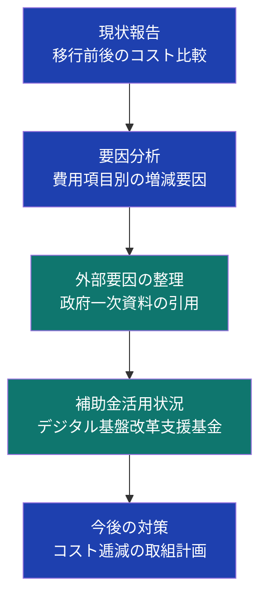

## はじめに：「なぜ高くなったのか」に答えられますか

ガバメントクラウド（以下、ガバクラ）への移行を終えた自治体の担当者が直面する難題のひとつが、**議会での費用増加に関する質疑**です。

「国が推進しているのに、なぜコストが上がるのか」「3割削減の目標はどうなったのか」——こうした議員からの問いは、担当者が事前に想定・準備していなければ、その場で的確に答えることは困難です。

デジタル庁が令和6年9月に公表した「ガバメントクラウドの先行事業における投資対効果の検証 中間報告」では、**宇和島市・須坂市・せとうち3市・美里町・川島町・笠置町**において、移行後のランニングコストが従前を上回る結果が確認されています（出典: デジタル庁、2024年9月6日公表）。

コスト増加は「担当者の失敗」ではなく、構造的要因によるものです。その構造を正確に理解し、一次ソースに基づいた資料を準備することが、議会対応の要となります。

本記事では、**議会説明資料の構成・作成ポイント・答弁準備**を、実際の政府資料をもとに解説します。

---

## 第1章：議会でよく出る質問と担当者が直面する課題

### 典型的な質疑パターン

議会でガバクラのコスト増加が問題になる場面は、大きく以下の3つに分類できます。

**1. 予算審議での質疑**
「今年度のシステム運用費が昨年比○○%増になっている理由は何か」という、予算書の数字に基づいた質問です。数値の根拠を明確に示せないと、「コスト管理ができていない」という印象を与えます。

**2. 一般質問での政策的質疑**
「国が推進するガバメントクラウドへの移行で、なぜ本市の費用が増加しているのか」という、政策判断の妥当性を問う質問です。担当部署だけでなく、首長・副首長レベルの答弁準備が必要になる場合もあります。

**3. 決算審査での事後評価**
「移行時に示したコスト見通しと実績の乖離はなぜ生じたか」という、実績検証の観点からの質問です。当初の計画資料との整合性が問われます。

### 担当者が抱える困難

多くの自治体担当者は、費用増加の「真の原因」を説明するための一次資料を手元に持っていないか、デジタル庁の資料が複雑すぎて議会向けに噛み砕けていないという状況にあります。また、クラウド費用の構造（通信回線費・クラウド利用料・運用管理補助委託費など）は、従来のオンプレミス型システムとは費用構造が根本的に異なるため、議員が直感的に理解しにくい側面もあります。

---

## 第2章：費用増加の構造的要因を理解する

議会への説明の前提として、担当者自身がコスト増加の構造的メカニズムを正確に理解している必要があります。

### デジタル庁が特定した費用増加の主要因

デジタル庁は先行事業の検証結果をもとに、費用増加の要因を以下のカテゴリに整理しています（出典: 「投資対効果の検証 中間報告」デジタル庁、2024年9月6日）。

**1. 通信回線費の増加**
オンプレミス環境では庁内ネットワークのみで完結していたシステムが、ガバクラ移行後はデータセンターとのWAN接続が必要になります。この回線増速・新設に伴うコストが、特に小規模団体で顕著な増加要因となっています。

**2. クラウド利用料の高止まり**
移行直後はクラウド最適化（リザーブドインスタンスやセービングプランの適用）が十分に進んでいないため、オンデマンド課金のままとなるケースがあります。デジタル庁の資料では、「長期継続割引（AWSにおけるリザーブドインスタンスやセービングプランといったファイナンスプランの適用は、依然として費用逓減に効果的」と明示されています（出典: 同上）。

**3. システム運用作業費の変動**
クラウド基盤への移行により、従前と異なる運用スキルが求められます。ベンダーへの運用管理補助委託費が増加する事例が複数報告されています。

**4. ソフトウェア借料・保守費の増加**
標準準拠パッケージへの切替に伴い、従前と異なるライセンス体系・保守料体系が適用されます。特に人口規模に応じた柔軟な料金設定が難しくなった事例が報告されています（出典: デジタル庁「標準化・ガバクラ移行後の運用経費の増加要因」2025年6月）。

**5. マクロ経済要因**
物価上昇、賃上げによる人件費増加、為替変動（特にドル建てのクラウド利用料）が、コスト増加の外部要因として挙げられています。これらは自治体側のコントロール外の要因であり、議会にも明確に説明すべき点です（出典: 同上）。

### コスト構造の可視化

移行前後のコスト比較を議会に示す際は、「費用項目ごとの変動」を分解して示すことが重要です。総額比較だけでは「全体として増えた」という印象しか与えられませんが、項目別に示すことで「何が増え、何が減ったか」が明確になります。

費用項目例:
- システム運用作業費
- ハードウェア保守費（オンプレミス解消により削減）
- クラウド利用料（新規増加項目）
- 通信回線費（増加）
- ソフトウェア借料・保守費
- データセンター利用費（解消により削減）

---

## 第3章：議会説明資料の構成と作成手順

議会説明資料は、「なぜ増えたか（原因の説明）」「今後どうなるか（見通しの説明）」「何をするか（対策の説明）」の3軸で構成します。

### 議会説明資料の全体構成フロー

### 各セクションの作成ポイント

#### セクション1：現状報告（移行前後のコスト比較）

表形式で「移行前（コストA）」と「移行後（コストB）」を費用項目別に比較します。神戸市の事例では、神戸市全体でコストBがコストAより7%削減（約2,500万円減）となっている一方、中小規模団体では逆に増加している構造を、自市の数値に当てはめて説明します。

**作成のポイント:**
- 単年比較だけでなく、5年間の累計比較を示す（移行コストが一時的に増加しても、中長期では逓減する場合がある）
- デジタル庁の公式フォーマット（項目分類）に準拠することで、国の検証事業との比較可能性を担保できる

#### セクション2：要因分析（費用項目別の増減要因）

費用増加が確認された項目ごとに、原因を具体的に説明します。この際、「本市固有の判断によるもの」と「構造的・政策的要因によるもの」を明確に分離することが重要です。

**作成のポイント:**
- デジタル庁の中間報告に記載された他自治体の類似事例を参照資料として添付することで、本市だけの問題ではないことを示す
- 「通信回線費は国が対策を検討中（短期対策：令和7年度末まで、中期対策：令和8年度以降）」といった、政府レベルでの認識・対応状況を盛り込む

#### セクション3：外部要因の整理（政府一次資料の引用）

マクロ経済要因（物価上昇・為替変動など）は、自治体が直接コントロールできる性質のものではありません。これらを「外部要因」として明示し、政府の一次資料（デジタル庁の報告書等）を出典として引用することで、説明の客観性を高めます。

**引用推奨資料:**
- デジタル庁「ガバメントクラウドの先行事業における投資対効果の検証 中間報告」（2024年9月6日）
- 内閣府規制改革推進会議WG資料「shiryou3-2.pdf」（2024年11月25日）
- デジタル庁「地方公共団体の基幹業務システムの統一・標準化に関する資料」（2025年6月）

#### セクション4：補助金活用状況（デジタル基盤改革支援基金）

移行経費に対する国の財政支援状況を説明します。「コストが増えているのに、補助金は活用できているのか」という議員の疑問に先回りして答えることが重要です。

デジタル基盤改革支援基金は、令和2年度第3次補正予算（国費10/10、1,508.6億円）を皮切りに、令和3年度補正予算（316.8億円）、令和5年度補正予算（5,163.1億円）、令和6年度補正予算（194.1億円）と積み増しが行われており、令和12年度末まで設置年限が延長されています（出典: 総務省「デジタル行財政改革の取組について」）。

**作成のポイント:**
- 自市が申請・受領した補助金額を明示する
- 補助対象外となった経費がある場合は、その理由を説明する
- 今後の補助申請予定がある場合は、時期・金額の見通しを示す

#### セクション5：今後の対策（コスト逓減の取組計画）

「今後どう改善するか」の見通しを示すことで、議会の懸念を前向きに転換します。デジタル庁が整理した対策案に沿って、本市での適用可能性を説明します。

**主な対策候補:**
- クラウド最適化（リザーブドインスタンス等の活用）
- 通信回線の合理化（代替回線サービスへの切替検討）
- 近隣自治体との共同利用拡大による単位コスト低減
- アプリケーションの効率化によるクラウドリソース削減

---

## 第4章：想定問答の準備

説明資料と並行して、想定問答集を整備することが不可欠です。以下に代表的なQ&Aのフレームを示します。

### Q1：「3割削減の目標はどうなったのか」

**答弁フレーム:**

「デジタル庁の目標は、現行システム運用経費等の3割削減です。これは移行完了後の安定稼働段階における目標であり、移行直後は移行コストの分散計上と最適化前のクラウド費用が重なるため、一時的に費用が増加するフェーズがあります。デジタル庁の先行事業検証においても、移行直後の費用増加は複数団体で確認されており、国レベルでの対策も講じられています。本市においても、クラウド最適化を進めることで、中期的な費用逓減を目指します。」

### Q2：「他の自治体ではどうか」

**答弁フレーム:**

「デジタル庁が令和6年9月に公表した中間報告によれば、先行事業に参加した自治体の中には費用増加となった団体が複数あります。具体的には宇和島市・須坣市・美里町・川島町・笠置町などで確認されています。一方、神戸市のように約7%のコスト削減を実現した事例もあり、団体の規模・業務構成・移行後の最適化状況によって差があります。」

### Q3：「担当者の見積もりが甘かったのではないか」

**答弁フレーム:**

「移行前の費用見積もりにおいて、デジタル庁の中間報告でも指摘されている通り、通信回線費や為替変動等のマクロ要因については、移行計画時点では織り込みが難しい側面がありました。デジタル庁は現在、自治体からの要望に基づく見積精査支援を拡充しており（330自治体からの要望に対し33自治体の精査が完了）、今後の見積精度向上に取り組んでいます（出典: デジタル庁資料、2025年6月）。」

### Q4：「補助金はいつまで使えるか」

**答弁フレーム:**

「デジタル基盤改革支援基金の設置年限は令和12年度末まで延長されており、標準準拠システムへの移行に要する経費については引き続き国費10割の補助が受けられます。ただし、移行完了後の通常運用コストは補助対象外となるため、安定稼働後のランニングコスト管理が課題です。」

---

## 第5章：資料作成における留意点

### 一次ソースへの確実な準拠

議会説明資料において最も重要なのは、**数値や事実の根拠を一次ソースに求めること**です。「〜と言われています」「〜という報道があります」ではなく、「デジタル庁○○報告書（○年○月）によれば」という形で出典を明示します。

これは、後から議員や監査委員が出典を確認した際の信頼性担保にもなります。

### 「課題認識」と「対応策」をセットで示す

費用増加を説明するだけでは「問題を把握している」にとどまります。「どう対処するか」の方針とスケジュールをセットで示すことで、行政として能動的にコスト管理に取り組んでいる姿勢を伝えられます。

デジタル庁は「令和7年度末までに当面実施する対策」と「令和8年度以降に実施する中期的対策」を区分けして整理しており、この時間軸を参照することで、本市の対応計画の説得力が高まります（出典: 内閣府規制改革推進会議WG資料、2024年11月25日）。

### 数値の取り扱い

費用の比較には、以下の点に注意が必要です。

- **年度ベース**: ガバメントクラウド関連の統計データは年度（4月始まり）で管理されています。暦年と混同しないよう注意が必要です
- **税込・税抜の統一**: 資料内で税込・税抜が混在しないよう統一します
- **補助金控除後の実質負担額**: 補助金を受領している場合、「総費用」と「自治体実質負担額」を明記することで、実態を正確に伝えられます

### GCInsightのデータを活用する

[GCInsightのコスト効果ダッシュボード](/costs)では、他自治体の移行コスト動向を参照できます。議会説明に際して「全国的な傾向との比較」として活用することで、本市の状況が特異なものではないことを客観的に示すことが可能です。また、[都道府県別の進捗状況](/prefectures)から、同規模自治体の状況を確認する参考材料としても活用できます。

---

## 第6章：議会対応後の継続的なコスト管理

一度の議会対応で終わらせず、継続的なコスト管理の仕組みを構築することが、次の質疑への備えになります。

### 定期的なコスト可視化レポートの整備

月次・四半期ごとにクラウド利用料・運用コストを費用項目別にモニタリングし、異常値が発生した際には即座に原因を把握できる体制を整えます。GCASコストダッシュボードなど、デジタル庁が提供するツールを積極的に活用してください。

### FinOpsの考え方を導入する

クラウドコストの最適化を継続的に行う「FinOps（Financial Operations）」の考え方は、自治体においても有効です。「[自治体のためのFinOps入門](/articles/gc-finops-guide)」では、リザーブドインスタンスの活用・使用量モニタリング・コスト配賦の具体的手法を解説していますので、担当者は合わせてご参照ください。

### 移行コストの構造的原因をより深く理解したい場合

費用増加の5つの構造的原因については、「[移行コストが3〜5倍に膨らむ5つの原因｜ガバメントクラウド](/articles/gc-migration-cost-causes)」で詳しく解説しています。議会説明資料の「要因分析」セクションの補足資料として活用できます。

---

## まとめ：説明資料は「防御」ではなく「対話」のツール

ガバメントクラウド移行後のコスト増加は、自治体担当者にとって説明が難しいテーマです。しかし、構造的要因を正確に把握し、一次ソースに基づいた資料を準備することで、議会との対話を建設的に進めることができます。

**議会説明資料作成の5ステップ:**

1. 費用項目別のコスト比較表を作成する（移行前・移行後）
2. 費用増加の要因を「自治体側要因」「政策的要因」「外部要因」に分類する
3. デジタル庁の公式資料を出典として引用し、他自治体との比較を示す
4. 補助金の活用状況と今後の見通しを明記する
5. コスト逓減のための取組計画と時間軸を示す

説明資料は「費用増加の言い訳」ではなく、「自治体が状況を正確に把握し、適切に対処している」ことを示す対話ツールです。議会との信頼関係を築くためにも、透明性と根拠の明確さを最優先に資料を整備してください。

---

## 参考資料

1. デジタル庁「ガバメントクラウドの先行事業における投資対効果の検証 中間報告」（2024年9月6日公表）
   https://www.digital.go.jp/assets/contents/node/basic_page/field_ref_resources/cadc83bd-9e0b-4c7c-883d-f09eeb314ecc/01ef7e78/20240906_policies_local_governments_government-cloud-interim-report_outline_03.pdf

2. 内閣府規制改革推進会議 行政・デジタルWG「標準化・ガバクラ移行後の運用経費について」（2024年11月25日）
   https://www5.cao.go.jp/keizai-shimon/kaigi/special/reform/wg6/20241125/pdf/shiryou3-2.pdf

3. デジタル庁「地方公共団体の基幹業務システムの統一・標準化に関する資料」（2025年6月13日）
   https://www.digital.go.jp/assets/contents/node/basic_page/field_ref_resources/c58162cb-92e5-4a43-9ad5-095b7c45100c/dc96d895/20250613_policies_local_governments_doc_02.pdf

4. 総務省「デジタル行財政改革の取組について（デジタル基盤改革支援基金）」
   https://www.soumu.go.jp/main_content/001053408.pdf

5. デジタル庁「地方公共団体向けガバメントクラウド活用支援（GCAS）ガイド（AWS）」
   https://guide.gcas.cloud.go.jp/aws/
