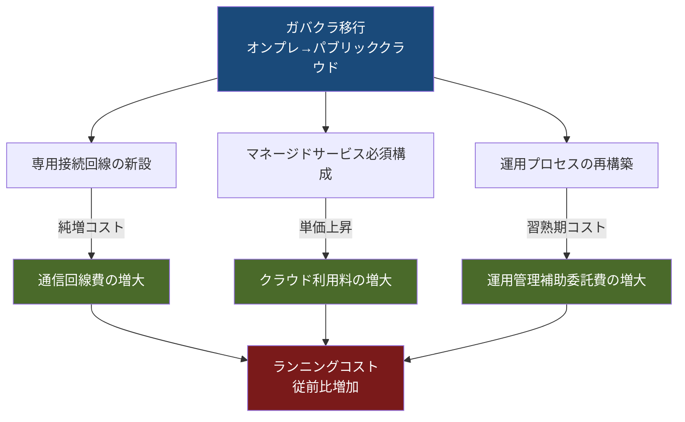

## はじめに：コスト増大は「失敗」ではなく「構造」の問題

ガバメントクラウド（以下、ガバクラ）移行後にランニングコストが従前を上回る——この事実は、一部の自治体のシステム調達・運用の失敗として語られることがあります。しかし、デジタル庁が令和6（2024）年9月に公表した「ガバメントクラウドの先行事業における投資対効果の検証 中間報告」（以下「中間報告」）を詳細に読み解くと、費用増大の要因は各自治体固有のミスではなく、**ガバクラ移行の構造そのものに内在する3つのメカニズム**に由来することが明確に示されています。

費用が増大した宇和島市・須坂市・せとうち3市・美里町・川島町・笠置町に共通するのは、「通信回線費」「クラウド利用料」「運用管理補助委託費」の3項目が純増または大幅増加したという事実です（出典: 内閣府規制改革推進会議 第6ワーキンググループ 資料3-2、2024年11月25日）。

本記事では、この3項目を「構造的要因」として個別に深掘りします。なお、コスト増大の要因一覧を広く浅く把握したい場合は、[移行コストが3〜5倍に膨らむ5つの原因](/articles/gc-migration-cost-causes)を先にご参照ください。本記事はその内容を前提に、3つの根本メカニズムに絞り込んで論じます。

---

## コスト構造の全体像：何が増えているのか

ガバクラ移行前（コストA）と移行後（コストB）の費用差を理解するには、まず費用構造の変化を把握する必要があります。

デジタル庁の中間報告では、コストAを「現行システムを継続した場合のランニングコスト」、コストBを「ガバクラへリフトし、推奨構成等を採用した場合のランニングコスト」と定義し、費用項目ごとに増減を比較しています（出典: デジタル庁「ガバメントクラウドの先行事業（基幹業務システム）における調査研究投資対効果の検証 中間報告」2024年9月6日）。

費用が増加した自治体では、以下の3項目が費用増加の主因として特定されました。

| 費用項目 | 増加の性質 | 代表的な事例 |
|---------|-----------|------------|
| 通信回線費 | 純増（ゼロ→有償） | 美里町・川島町で2,400万円/年の純増 |
| クラウド利用料 | オンプレとの構成差異による増加 | マネージドサービス採用による単価上昇 |
| 運用管理補助委託費 | 移行直後の新規作業増による増加 | データセンター運用と比較し工数増 |

この3項目は偶然同時に発生したのではなく、ガバクラという基盤の「構造」から必然的に生じています。以下、各要因を順に論じます。

---

## 構造的要因の関係図

上図が示す通り、ガバクラへの移行という一つの決定が、3つの異なる費用増加メカニズムを同時に発動させます。それぞれのメカニズムには独自の原因と対策が存在します。

---

## 構造的要因1：通信回線費の純増

### なぜゼロだったものが突然発生するのか

オンプレミス環境では、庁舎内のサーバーと業務端末は庁内LANで接続されており、外部への専用通信回線費は発生しないケースが大半です。しかし、ガバクラへ移行した瞬間に、クラウドリージョン（AWSであれば東京リージョン等）との通信を確保するための**専用接続回線が必須**となります。

デジタル庁の中間報告において最もわかりやすい事例は美里町・川島町のケースです。同自治体ではガバクラ移行後に「通信回線費」が**2,400万円/年の純増**となりました。これは移行前（コストA）がゼロであったものが、移行後（コストB）に2,400万円が新たに発生した費用であり、他の項目の削減効果を大きく上回る規模となっています（出典: デジタル庁「中間報告」2024年9月6日）。

### 通信回線費が構造的に増加する3つの理由

**理由1：物理的な接続形態の変化**
オンプレでは庁舎内で完結していた通信経路が、ガバクラ移行後はインターネットまたは閉域網を経由してクラウドリージョンに接続する形態に変わります。セキュリティ要件を満たすためには、一般のインターネット回線ではなく専用線またはMPLS等の閉域網が必要となるケースが多く、その月額費用が恒常的な支出として固定化します。

**理由2：冗長化・可用性要件の充足コスト**
ガバクラの標準構成では、可用性確保のために通信経路の冗長化が求められます。主回線と冗長回線の2本分の費用が発生するため、単純計算で通信コストが倍増します。

**理由3：帯域幅の適正化に時間を要する**
移行直後は、実際の業務負荷に対して適切な帯域幅を見積もることが困難なため、過剰な帯域を契約するケースが多くなります。業務実績データが蓄積されて初めて適正なダウンサイジングが可能となりますが、この最適化には通常1〜2年を要します。

### 対策の方向性

デジタル庁の中間報告では、通信回線費への対策として「合理的と判断する通信回線サービスの検討」を挙げています。具体的には、ガバクラ向けの接続をデータセンター向け回線に集約すること（盛岡市の事例）や、複数自治体で通信コストを分担する共同利用モデルへの移行が有効とされています。

---

## 構造的要因2：クラウド利用料の増大

### サービスレベル向上という「意図的なコスト増」

クラウド利用料の増加には、オンプレとの「サービスレベルの差」という構造的背景があります。デジタル庁の資料（2025年6月13日付）では、この点について以下のように明記されています。

> 「現行システム基盤であるオンプレやベンダクラウドと比べて、ガバクラ移行によりサービスレベルが向上（セキュリティレベルの高度化、大規模災害に備えた対策の実現等）していること（クラウド利用料の増加）」（出典: デジタル庁「地方公共団体の基幹業務システムの統一・標準化に関する検討会 資料2」2025年6月13日）

つまり、クラウド利用料の一部は**意図的かつ正当なサービスレベルの向上コスト**です。DR（ディザスタリカバリ）対策やセキュリティ強化は、オンプレ時代に未実装だったものを初めて実装するケースも多く、その分のコストが追加されます。

### マネージドサービス採用による単価上昇

一方で、問題となるのはマネージドサービスの活用方法の不適切さです。AWSやOCIのマネージドサービスは、管理負荷を削減する代わりに従量課金や固定月額が発生します。

デジタル庁の中間報告では、マネージドサービスの利用コストが増加要因の一つとして特定されており、「マネージドサービスの最適な利用方法の検討が重要」と指摘されています。具体的には、不要なマネージドサービスの整理、リザーブドインスタンス・セービングプラン等の長期継続割引の適用、Auto Scalingによるリソースの動的調整などが費用逓減の手段として示されています（出典: デジタル庁「中間報告」2024年9月6日）。

### パッケージベンダーの料金体系変化という構造問題

さらに深刻な問題は、パッケージベンダーがガバクラ対応に伴い料金体系を変更したことです。デジタル庁の資料では以下の点が指摘されています。

> 「システム提供事業者がシステムと基盤の一体提供ができず、人口規模等に応じた柔軟な料金設定が難しくなったこと（ソフトウェア借料、クラウド利用料の増加）」（出典: デジタル庁「地方公共団体の基幹業務システムの統一・標準化に関する検討会 資料2」2025年6月13日）

オンプレ時代は「ハードウェア＋ソフトウェア＋保守」を一体でパッケージ提供していたベンダーが、ガバクラ移行後は基盤（クラウド）とアプリケーションを分離してそれぞれ個別契約となります。この構造変化により、小規模自治体でも大規模自治体と同じ基盤コストを負担する形となり、人口規模に応じたコスト配分の柔軟性が失われています。

GCInsightでは各クラウド別のベンダー・パッケージ情報を整理しています。自治体規模に応じた選定の参考として[クラウド別ベンダー一覧](/cloud)もご活用ください。

---

## 構造的要因3：運用管理補助委託費の増大

### 移行直後に不可避な「習熟コスト」

3つ目の構造的要因は、運用管理に関わる人件費・委託費の増加です。ガバクラは従来のオンプレやデータセンター運用とは根本的に異なるオペレーションを要求します。

デジタル庁の中間報告では、以下の点が費用増加の原因として明記されています。

> 「自治体クラウド（データセンター）運用工数と比較し、ガバメントクラウド移行後は新規運用作業（運用管理補助業務等）が現状増えたことで費用増加（現時点では移行直後のためデータセンター運用と比較し、工数増となっている）」（出典: デジタル庁「中間報告」2024年9月6日）

「現時点では移行直後のため」という表現に注目する必要があります。運用管理補助委託費の増加は、移行直後という時点に依存した**一時的な習熟コスト**としての性格を持ちます。しかし、この「一時的」な期間が数年に及ぶ可能性があり、財政的な計画に影響を与えます。

### 新規発生する運用作業の内容

オンプレ時代には存在しなかった、または外部委託していなかった作業が、ガバクラ移行後に自治体の運用管理として新たに発生します。主なものとして以下が挙げられます。

- **クラウドコスト管理**: 従量課金の監視・分析・最適化（FinOpsに相当）
- **セキュリティ設定の継続的確認**: クラウド環境のセキュリティ設定は変化し続けるため、定期的なレビューが必要
- **パッチ・バージョン管理の調整**: マネージドサービスのバージョンアップ対応
- **複数ベンダーの調整業務**: 基盤（クラウド）とアプリケーション（パッケージベンダー）の分離に伴う、SLA・責任範囲の調整業務

これらの作業は、クラウドネイティブな知識を持つ人材がいない多くの自治体では、外部の運用管理支援事業者への委託を通じてコストが発生します。

### 標準仕様書の頻繁な改定という追い打ち

運用管理コストを押し上げるもう一つの要因として、標準仕様書の度重なる改定があります。デジタル庁の資料では以下のように指摘されています。

> 「令和8年度以降も影響を及ぼす大規模な制度改正等（異次元の少子化対策、ふりがな法制化等）に伴う標準仕様書の度重なる改定により開発経費が増加していること（ソフトウェア借料の増加）」（出典: デジタル庁「地方公共団体の基幹業務システムの統一・標準化に関する検討会 資料2」2025年6月13日）

異次元の少子化対策やふりがな法制化などの制度改正は、標準仕様書の改定を繰り返し引き起こし、パッケージベンダーは対応開発費を自治体のソフトウェア借料として転嫁します。これは「移行前には存在しなかったコスト」ではなく、「移行後に表面化した制度改正コストの転嫁構造」という形で現れます。

---

## 3要因の相互作用：なぜ複合的に増大するのか

ここまで3要因を個別に論じてきましたが、実際のコスト増大では3要因が相互に影響し合いながら複合的に膨らむ点が重要です。

たとえば美里町・川島町の事例では、通信回線費の純増（2,400万円）がランニングコスト全体を押し上げる中で、さらにクラウド利用料の増加と運用管理補助委託費の増加が同時に発生しました。各要因への個別対策を講じても、3要因が同時発動している状況では総コストの削減には時間がかかります。

デジタル庁の中間報告はこの複合性を認識しており、対策も単一の施策ではなく、①通信回線の最適化、②より多数の団体での共同利用、③運用知見の蓄積による工数削減、④マネージドサービスの活用による自動化・効率化、⑤クラウド最適化とアプリ効率化の組み合わせ、という多層的なアプローチを提示しています。

移行後のコスト増大リスクの全体像については[遅延リスク一覧](/risks)でも確認できます。

---

## 自治体担当者が今すべき3つのアクション

### アクション1：コスト増大の「どの要因か」を特定する

自治体のコスト超過が3要因のどれに起因するかを特定することが最初のステップです。費用項目別の増減を「移行前（コストA）vs 移行後（コストB）」の形式で整理し、通信回線費・クラウド利用料・運用管理費のそれぞれの増減率を明確にします。

要因の特定なしに対策を講じても、費用増加の根本を止めることはできません。

### アクション2：共同利用の可能性を探る

3要因のいずれに対しても、近隣自治体との共同利用は有効な対策となります。通信回線費は複数自治体でシェアすることで単価が下がり、クラウド利用料はワークロードの統合によりリザーブドインスタンスの適用範囲が広がり、運用管理費は知見の共有により効率化が図れます。

### アクション3：議会・首長への説明準備を行う

コスト増大は多くの場合、議会での質問事項となります。3要因を整理した上で「構造的な要因であること」「対策を講じている事実」「今後の費用逓減の見通し」をセットで説明できる資料を準備することが重要です。議会向け説明資料の作成については[コスト増加を議会に説明する資料ガイド](/articles/gc-cost-report-guide)を参照してください。

また、FinOpsの観点からクラウド費用を継続的に最適化する手法については[自治体のためのFinOps入門](/articles/gc-finops-guide)で詳しく解説しています。

---

## まとめ：構造を知ることが対策の出発点

ガバメントクラウド移行後のコスト増大は、個々の自治体の調達ミスや予算計画の失敗に帰因するものではなく、移行という構造変化そのものに内在する3つのメカニズムから生じます。

- **通信回線費の純増**: 庁内完結だった通信経路が、外部クラウドへの専用接続に変わることで新たに固定費が発生する
- **クラウド利用料の増大**: サービスレベル向上・マネージドサービス採用・ベンダー料金体系の変化が重なり単価が上昇する
- **運用管理補助委託費の増大**: クラウド固有の運用作業が新たに発生し、習熟するまでの委託費が増加する

これら3要因は単独で発生するのではなく、移行という一つの決定が同時に誘発します。対策には単発の施策ではなく、デジタル庁が示す多層的アプローチ——共同利用の拡大、クラウド最適化、運用知見の蓄積——を体系的に実行することが求められます。

GCInsightでは、自治体のガバクラ移行の進捗・コスト・リスクに関するデータを一元的に可視化しています。[ダッシュボード](/）から全国の状況を確認してみてください。

---

## 参考資料

1. デジタル庁「ガバメントクラウドの先行事業（基幹業務システム）における調査研究投資対効果の検証 中間報告（令和6年9月6日公表）」
   https://www.digital.go.jp/assets/contents/node/basic_page/field_ref_resources/cadc83bd-9e0b-4c7c-883d-f09eeb314ecc/01ef7e78/20240906_policies_local_governments_government-cloud-interim-report_outline_03.pdf

2. 内閣府規制改革推進会議 第6ワーキンググループ「資料3-2」（2024年11月25日）
   https://www5.cao.go.jp/keizai-shimon/kaigi/special/reform/wg6/20241125/pdf/shiryou3-2.pdf

3. デジタル庁「地方公共団体の基幹業務システムの統一・標準化に関する検討会 資料2」（2025年6月13日）
   https://www.digital.go.jp/assets/contents/node/basic_page/field_ref_resources/c58162cb-92e5-4a43-9ad5-095b7c45100c/dc96d895/20250613_policies_local_governments_doc_02.pdf

4. デジタル庁「地方公共団体の基幹業務システムの統一・標準化に関する検討会 議事概要2」（2025年6月16日）
   https://www.digital.go.jp/assets/contents/node/basic_page/field_ref_resources/e9da3694-1711-401f-bfc3-222d2d923990/8b09a979/20250616_meeting_local_governments_outline_02.pdf
