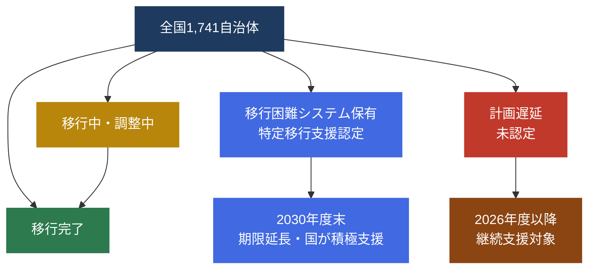

## はじめに：2026年3月末、移行期限の今

2026年3月末（令和7年度末）は、地方公共団体の基幹業務システムを標準準拠システムへ移行することを目指す期限として、デジタル庁・総務省が「移行支援期間」の目標として設定した節目です。

しかし現時点において、全1,741自治体が期限どおりに移行を完了しているわけではありません。本記事では、なぜ遅延が生じているのか、国はどのような制度的対応を設けているのか、そして自治体はいま何をすべきなのかを、デジタル庁・総務省の公式資料をもとに整理します。

**重要な前提として**、「期限までに移行が完了しない」ことと「単純な遅延」は制度上別の概念です。移行が完了しない自治体には、国が制度的に認定した「移行困難システム（特定移行支援システム）」を抱えるケースと、計画の遅滞によるケースがあり、両者を混同すると実態把握を誤ります。詳しくは [「特定移行支援と「遅延」の違い」](/articles/gc-tokutei-vs-delay) をご覧ください。

---

## 移行期限の法的根拠と「移行支援期間」の定義

地方公共団体の基幹業務システムの統一・標準化は、「地方公共団体情報システムの標準化に関する法律」（標準化法）に基づいています。

デジタル庁・総務省は、移行目標について以下のように定めています。

> 令和５年（2023年）４月から令和８年（2026年）３月までを「移行支援期間」と位置付け、国はそのために必要な支援を積極的に行う。また、地方公共団体は、令和５年（2023年）３月末時点での標準化対象事務に係る基幹業務システムを、令和５年（2023年）３月末時点で公表された標準仕様書に適合した標準準拠システムに、令和７年度（2025年度）末までに移行することを目指す。
>
> （出典: 総務省「地方公共団体の基幹業務等システムの統一・標準化に関する計画」、デジタル庁「地方公共団体の基幹業務システムの統一・標準化　第4回地方公共団体向け説明会資料」）

ここで重要な点が2つあります。

1. **「移行することを目指す」という努力目標の表現** — 法律上の強制期限ではなく、「移行支援期間」における国の支援のもとで達成を目指す目標です。
2. **「移行支援期間」は2026年3月まで継続** — 移行が完了していない団体に対しても、2026年3月まで国の支援が提供されます。

---

## 移行が遅れている構造的な原因

### 原因1：標準仕様書の改定サイクルと開発期間のミスマッチ

標準準拠システムの開発には、ベンダー側での仕様適合・テスト・リリースに一定の時間が必要です。しかし、標準仕様書は順次改定が行われており、開発着手時点の仕様が後から変更されるケースが生じました。

総務省のロードマップ（出典: 総務省 `000966924.pdf`）では、移行困難システムを有する地方公共団体への移行支援を2026年度・2027年度にかけて継続実施することが明示されており、2025年度末での完結を前提としない設計となっています。

### 原因2：ベンダーの開発リソース集中と不足

全国1,741自治体が同一期間内に移行を進めるため、標準準拠システムの開発・導入を担うベンダーのSE・PMリソースが特定時期に集中し、供給不足が発生しています。

特に小規模自治体では、地域担当ベンダーの体制が限られており、大規模自治体に比べてスケジュールが後ろ倒しになりやすい傾向があります。

### 原因3：「移行困難システム」の認定制度の整備

一部の自治体は、既存システムの構造的な複雑さや、特殊業務への対応が標準仕様書では困難と認められたシステムを抱えています。こうしたシステムは「移行困難システム（特定移行支援システム）」として国が個別に認定し、2030年度末という延長された完了期限が設定されます。

この制度はあくまで国による積極的な支援を伴う「認定制度」であり、単なる期限延長ではありません。詳しくは [「特定移行支援システム認定935自治体の完全一覧」](/articles/gc-tokutei-iko-list) をご参照ください。

---

## 遅延状況の全体像：ステータス別マップ

以下のMermaid図は、2026年3月末時点における各自治体の移行ステータスの大まかな分類を示しています。

**図の見方**
- 移行完了（緑）: 2025年度末までに標準準拠システムへの移行を完了した自治体
- 移行中・調整中（黄）: 最終段階の検証・並行稼働・受入検査が進行中の自治体
- 特定移行支援認定（青）: 移行困難システムを保有し、国の認定のもと2030年度末を目標とする自治体
- 計画遅延・未認定（赤）: 認定を受けないまま期限内の完了が困難な状態にある自治体

---

## 「遅延自治体」として見られるリスクと対応

### 補助金・財政措置への影響

ガバメントクラウドへの移行に伴う経費については、デジタル庁・総務省による財政支援が設けられています。しかし、移行計画の進捗が著しく停滞している場合、支援対象から外れるリスクがあります。

移行コストが3〜5倍に膨らむ事例が報告されているなか（出典: 内閣府規制改革WG資料、2024年11月25日）、財政支援を適切に活用するためにも、遅延状態を早期に解消することが重要です。コスト膨張の構造的原因については [「移行コストが3〜5倍に膨らむ5つの原因」](/articles/gc-migration-cost-causes) をご覧ください。

### 住民サービスへのリスク

基幹業務システムの移行が長引くほど、以下のリスクが高まります。

- 老朽化した現行システムの保守・維持コストの増大
- 標準仕様書の改定に追従できず、制度改正への対応が遅延する
- 住民向けオンライン手続きの整備が後回しになる

### 対応の方向性：「特定移行支援」認定の活用

移行困難な状況にある自治体には、単純に期限を超過するのではなく、「移行困難システム」としての認定申請を検討することが現実的な対応です。認定を受けることで：

- 2030年度末までの期限延長
- デジタル庁・総務省による個別支援
- 国の専門家チームによる技術的助言

といった支援を受けることができます（出典: 総務省「地方公共団体の基幹業務等システムの統一・標準化に関する工程表」`000966924.pdf`）。

---

## 遅延を防ぐための実務チェックリスト

自治体のDX担当者が確認すべき項目をまとめます。

### 移行状況の把握
- [ ] 標準化対象となる20業務システムの移行状況を業務単位で把握しているか
- [ ] 各システムの担当ベンダーから最新のスケジュール報告を受けているか
- [ ] 並行稼働・受入検査の完了期限を確定しているか

### 移行困難システムの確認
- [ ] 標準仕様書への適合が困難と判断されるシステムを特定しているか
- [ ] 「移行困難システム」の認定申請を検討しているか
- [ ] デジタル庁・総務省への相談窓口（自治体支援コンタクト）を把握しているか

### 財政・補助金の確認
- [ ] 移行費用の財政支援（デジタル田園都市国家構想交付金等）の申請状況を確認しているか
- [ ] ガバメントクラウドの利用料に係る財政支援の対象期間を確認しているか

---

## 今後のスケジュール感

デジタル庁・総務省は、移行が完了しない自治体に対しても「移行支援期間」終了後も継続して支援を実施する方針を明示しています。

| 時期 | 主な対応 |
|------|---------|
| 2026年3月末 | 移行支援期間の目標期限。多くの自治体で移行完了を目指す |
| 2026年4月以降 | 未完了自治体への継続支援。移行困難システムを抱える自治体は個別支援が継続 |
| 2027年度 | 開発事業者へのフォローアップ・移行困難システムを有する自治体への集中支援 |
| 2030年度末 | 特定移行支援システム認定自治体の最終完了期限 |

（出典: 総務省「地方公共団体の基幹業務等システムの統一・標準化に関する工程表」`000966924.pdf`、`000904550.pdf`）

---

## GCInsightで遅延リスクを確認する

GCInsightでは、全国自治体の移行進捗・遅延リスクスコアをダッシュボードで可視化しています。

- **[遅延リスク一覧](/risks)** — 移行遅延リスクの高い自治体を一覧で確認
- **[ダッシュボード](/)** — 都道府県別・業務別の移行進捗を俯瞰

自治体のDX担当者はもちろん、入札・提案を検討するベンダー担当者にとっても、どの自治体でどの業務の移行が遅れているかを把握することは、営業・支援戦略の立案に直結します。

---

## まとめ

2026年3月末を迎えた現在、ガバメントクラウド標準準拠システムへの移行状況は自治体によって大きく異なります。重要なポイントを整理します。

1. **「令和7年度末」は努力目標** — 「移行支援期間」の目標であり、法律上の強制期限ではない
2. **遅延には制度的に認められたケースがある** — 特定移行支援システムの認定を受けた自治体は2030年度末まで期限が延長される
3. **未認定のまま遅延することにはリスクがある** — 財政支援の機会損失や老朽システムの保守コスト増大が見込まれる
4. **早期の状況把握と相談が鍵** — デジタル庁・総務省への相談窓口を活用し、移行困難システムの認定申請を検討することが現実的な対応

自治体の担当者は、現在の進捗状況を正確に把握したうえで、適切な制度的対応を選択することが求められます。

---

## 参考資料

- デジタル庁「地方公共団体の基幹業務システムの統一・標準化」
  https://www.digital.go.jp/policies/local_governments/
- デジタル庁「ガバメントクラウド先行事業（市町村の基幹業務システム等）の中間報告」
  https://www.digital.go.jp/policies/local_governments/government-cloud-interim-report
- 総務省「地方公共団体の基幹業務等システムの統一・標準化に関する計画」
  https://www.soumu.go.jp/main_content/000966924.pdf
- 総務省「地方公共団体の基幹業務等システムの統一・標準化に関する計画（改定版）」
  https://www.soumu.go.jp/main_content/000904550.pdf
- デジタル庁「地方公共団体の基幹業務システムの統一・標準化に関する基本方針（改定）」
  https://www.digital.go.jp/assets/contents/node/basic_page/field_ref_resources/66264825-2451-43ce-8da5-1adce44c72b8/24cc7ebe/20241219_meeting_local_governments_outline_04.pdf
- 内閣府規制改革推進会議WG「ガバメントクラウドの先行事業における投資対効果の検証中間報告」（2024年11月25日）
  https://www5.cao.go.jp/keizai-shimon/kaigi/special/reform/wg6/20241125/pdf/shiryou3-2.pdf
