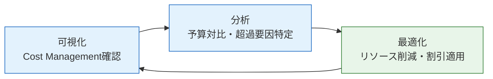

## はじめに：移行後こそコスト管理が本番

ガバメントクラウド（以下、ガバクラ）への移行は「完了」ではなく「スタート」です。オンプレミス環境では固定費として見えにくかったインフラコストが、クラウド移行後は利用量に応じた変動費として可視化されます。適切に管理すれば削減できますが、放置すれば想定外の費用超過が続きます。

デジタル庁が公表した「ガバメントクラウドの適切な利用によるコスト最適化のアプローチガイド」（GCASガイド）では、この継続的なコスト削減活動を **FinOps（フィンオプス）** と定義しています。FinOpsとは「Finance（財務）」と「DevOps（開発・運用）」を組み合わせた概念であり、**IT部門・実務部門・財務部門が連携してクラウド利用料の継続的な管理と削減を目指す取組**です（出典: GCASガイド `guide.gcas.cloud.go.jp/aws/`）。

本記事では、自治体情報システム担当者がすぐに実践できるFinOpsの考え方と具体的な手順を、デジタル庁の一次資料をもとに解説します。

---

## なぜ「移行後」にコストが増えるのか

ガバクラへの移行後、一部の自治体でランニングコストが従前を上回る事態が生じています。デジタル庁が令和6年9月に公表した「ガバメントクラウドの先行事業における投資対効果の検証 中間報告」によれば、費用増加が確認された主な自治体（宇和島市・須坂市・せとうち3市・美里町・川島町・笠置町）では、費用増加の原因として **「通信回線費」「クラウド利用料」「運用管理補助委託費」** の3項目が挙げられています（出典: デジタル庁 中間報告 2024年9月6日公表）。

コスト増加の背景には、**移行時点での最適化不足**と**移行後の継続的管理の欠如**があります。クラウドは設計次第で費用が大きく変動します。オンプレミス時代の「年度初めに予算を確定し、年度末まで固定」という発想では通用しません。

詳しいコスト増大の構造的原因については、[移行コストが3〜5倍に膨らむ5つの原因｜ガバメントクラウド](/articles/gc-migration-cost-causes) で解説しています。

---

## FinOpsの3ステップサイクル

GCASガイドが推奨するコスト管理の基本フローは、月次で **「可視化」→「分析」→「最適化」** の3段階を繰り返すサイクルです（出典: GCASガイド `guide.gcas.cloud.go.jp/` セクション「定常的なコスト管理運用フロー」）。

このサイクルは月次が基本ですが、**半期に一度は全サービスを対象とした包括的なレビュー**も推奨されています。また、予算アラートが発動した場合は月次サイクルを待たず、任意のタイミングで最適化を実施する必要があります。

### ステップ1：可視化

前月末のコストをCost Management（AWS Cost Explorer・Azure Cost Management・GCP Cloud Billing等）で確認します。クラウド利用に伴う実績の確定は**翌月3〜7日が一般的**であるため、対象月の実績は翌月7日以降に確認することが推奨されています（出典: GCASガイド `guide.gcas.cloud.go.jp/`）。

確認すべき主な指標は以下の通りです。

- 月別クラウド利用料の推移
- サービス別・システム別のコスト内訳
- 予算に対する実績の乖離率
- 予算アラートの発動状況

これらをダッシュボード化し、庁内関係者が常時参照できる状態にすることが望ましいとされています。

### ステップ2：分析

可視化で把握した実績をもとに、費用増加・費用超過の要因を特定します。特に注目すべきポイントは次の3点です。

**（1）アイドルリソースの存在**
利用されていないEC2インスタンス・仮想マシン・ストレージが稼働し続けているケースです。使用率の低いリソースは、サイジングダウンまたは削除の対象になります。

**（2）割引プランの未適用**
オンデマンド料金のままで利用しているリソースがないかを確認します。安定的に利用するリソースには長期継続割引（リザーブドインスタンス等）が適用できます。

**（3）データ転送費の発生**
クラウドとオンプレミス間、またはクラウド間のデータ転送に意外なコストが発生しているケースがあります。通信アーキテクチャの見直しで削減できる場合があります。

### ステップ3：最適化

分析で特定した課題に対し、コスト最適化施策を実施します。主な手法を以下に整理します。

---

## 主要なコスト最適化施策

### 施策1：リザーブドインスタンス・長期継続割引の活用

GCASガイドでは、**「長期継続割引（リザーブドインスタンス等）の適用は、依然として費用逓減に効果的」** と明記されています（出典: デジタル庁 中間報告 資料3-2、2024年9月6日公表）。

各クラウド事業者の長期継続割引制度は以下の通りです。

| クラウド事業者 | 割引制度の名称 | 特徴 |
|---|---|---|
| AWS | リザーブドインスタンス / セービングプラン | 1〜3年の事前確約で最大72%割引 |
| Google Cloud | 確約利用割引（CUD） | 1〜3年の確約で最大57%割引 |
| Microsoft Azure | リザーブドインスタンス | 1〜3年の確約で最大72%割引 |
| Oracle Cloud（OCI） | ユニバーサルクレジット | 年間確約で20〜33%割引 |

GCASガイド（メンバー専用ページ）では、各クラウドの長期継続割引手順が掲載されており、ガバクラ利用機関はGCASアカウント取得後に参照できます（出典: GCASガイド `guide.gcas.cloud.go.jp/aws/`）。

リザーブドインスタンス適用にあたって自治体が注意すべき点は、**年度予算との整合性**です。3年確約の場合、複数年度にわたるコミットメントが生じます。財務部門・情報システム部門が連携し、複数年の利用見込みを試算したうえで適用範囲を決定することが重要です。

### 施策2：マネージドサービスへの移行による運用費削減

GCASガイド（AWS技術ガイド）では、バックアップ処理について「マネージドサービスへの移行、夜間から日中バックアップへの変更」を削減アプローチとして例示しています（出典: GCASガイド `guide.gcas.cloud.go.jp/aws/` セクション「単純移行で想定される運用作業項目と削減アプローチ例」）。

マネージドサービスの活用は2つの側面でコストを削減します。

- **インフラ管理コストの削減**: OS・ミドルウェアのパッチ適用・監視等の人的作業が不要になる
- **自動化による省力化**: スケーリング・障害対応・バックアップが自動化され、運用管理補助委託費が減少する

自治体システムの場合、夜間バックアップを日中に移行するだけでも、従量課金の低単価時間帯を活用できる場合があります。

### 施策3：IaC（Infrastructure as Code）導入による省力化

GCASガイドでは「IaC導入による省力化」も削減アプローチの一つとして挙げられています（出典: GCASガイド `guide.gcas.cloud.go.jp/aws/`）。IaCを活用することで、環境構築・変更の自動化が可能になり、手作業に伴うヒューマンエラーやコスト増大リスクを低減できます。

### 施策4：多団体共同監視による費用逓減

デジタル庁の分析では、「多団体の監視等を一元化することで費用を逓減」という対策案が示されています（出典: デジタル庁 中間報告 資料3、2024年9月6日公表）。複数の自治体が共同でガバクラを利用することで、監視・運用管理のコストを按分し、一団体あたりの負担を削減できます。

広域連合・一部事務組合・都道府県主導の共同利用スキームを検討している自治体は、GCInsightの[コスト効果分析](/costs)でシミュレーション結果を確認することができます。

---

## FinOps推進体制の構築

FinOpsは技術的な取組である以前に、**組織的な取組**です。GCASガイドでは、コスト削減の結果として年度内に予算余剰が生じる場合も想定し、「行政サービスの向上へ資する取組へ充当する」という方針を示しています（出典: GCASガイド `guide.gcas.cloud.go.jp/aws/`）。つまり、削減した予算を次の施策に再投資するサイクルを構築することがFinOpsの本質的な目的です。

自治体におけるFinOps推進体制のポイントを以下に示します。

### 役割分担の明確化

| 関係者 | 役割 |
|---|---|
| 情報システム担当 | コスト可視化・技術的最適化の実施、ベンダーへの改善指示 |
| 財務・総務担当 | 予算管理・年度をまたぐ確約割引の承認 |
| 首長・副首長 | 余剰予算の行政サービス充当の意思決定 |
| 運用管理補助事業者 | 月次コスト報告・最適化施策の実行 |

### 運用保守契約へのFinOps要件の組み込み

GCASガイドは「運用保守契約を締結する際、運用作業項目を明細化し、改善対象とする作業を特定する」ことを推奨しています（出典: GCASガイド `guide.gcas.cloud.go.jp/aws/`）。具体的には、**調達仕様書にFinOps実施・定量的改善効果の計測・報告を要件として明記**することが効果的です。

改善効果が計測された場合には、翌年度以降の運用保守契約に費用削減を反映させる仕組みを構築します。これにより、ベンダーにも継続的なコスト最適化のインセンティブが生まれます。

---

## 自治体が今すぐ始められる3つのアクション

FinOpsの取組は大規模なシステム変更なしに始められます。以下の3つを最初のステップとして実施することを推奨します。

**アクション1：コスト可視化ダッシュボードの整備（1〜2ヶ月）**

各クラウド事業者の標準機能（AWS Cost Explorer・Azure Cost Management等）を活用し、月別コストを可視化するダッシュボードを整備します。まず現状を「見える化」することがすべての出発点です。

**アクション2：リソース利用状況の棚卸し（1〜3ヶ月）**

起動中のインスタンス・ストレージ・ネットワーク機能の利用率を確認し、アイドルリソースを特定します。利用率が一定水準を下回るリソースはサイジングダウンまたは削除の候補です。

**アクション3：長期継続割引の適用検討（3〜6ヶ月）**

安定的に利用しているリソースを特定し、リザーブドインスタンスまたは確約利用割引の適用を検討します。適用前に財務部門と連携し、複数年のコミットメントに問題がないかを確認します。

---

## まとめ：ガバクラのコスト最適化はFinOpsで継続的に

ガバメントクラウドのコスト最適化は、移行プロジェクトの終了と同時に始まる継続的なマネジメント活動です。デジタル庁のGCASガイドが示すように、「可視化→分析→最適化」のサイクルを月次で回し、リザーブドインスタンスの活用・マネージドサービスへの移行・共同監視の活用を組み合わせることで、費用の逓減は十分に実現可能です。

組織体制の整備、調達仕様へのFinOps要件の組み込み、財務部門との連携といった**人・組織・契約**の側面も含めて取り組むことが、持続的なコスト最適化の鍵となります。

GCInsightでは、各自治体・各クラウドのコスト傾向を[コスト効果ダッシュボード](/costs)で確認できます。自団体の現状把握にぜひご活用ください。

---

## 参考資料

1. デジタル庁「GCASガイド（ガバメントクラウド AWS技術ガイド）」
   `https://guide.gcas.cloud.go.jp/aws/`

2. デジタル庁「GCASガイド（定常的なコスト管理運用フロー）」
   `https://guide.gcas.cloud.go.jp/`

3. デジタル庁「令和5年度ガバメントクラウド先行事業 投資対効果の検証 中間報告（令和6年9月6日公表）」
   `https://www.digital.go.jp/assets/contents/node/basic_page/field_ref_resources/cadc83bd-9e0b-4c7c-883d-f09eeb314ecc/78a50e63/20240906_policies_local_governments_government-cloud-interim-report_outline_01.pdf`

4. デジタル庁「令和5年度ガバメントクラウド先行事業 中間報告 資料3-2」
   `https://www.digital.go.jp/assets/contents/node/basic_page/field_ref_resources/cadc83bd-9e0b-4c7c-883d-f09eeb314ecc/01ef7e78/20240906_policies_local_governments_government-cloud-interim-report_outline_03.pdf`

5. 内閣府規制改革推進会議 行政改革WG「地方公共団体の基幹業務システム統一・標準化（コスト検証資料3-2）」（2024年11月25日）
   `https://www5.cao.go.jp/keizai-shimon/kaigi/special/reform/wg6/20241125/pdf/shiryou3-2.pdf`
