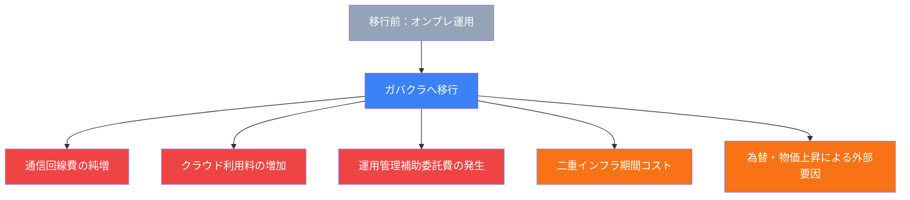

## はじめに：「移行すれば安くなる」は本当か

ガバメントクラウド（以下、ガバクラ）への移行は、国・地方自治体のシステム運用コストを「現行システム運用経費等の3割削減」することを目標として掲げています（出典: デジタル庁「地方公共団体の基幹業務システムの統一・標準化」2025年6月）。

しかし現実は一様ではありません。デジタル庁が令和6年9月に公表した「ガバメントクラウドの先行事業における投資対効果の検証 中間報告」によれば、先行事業に参加した自治体の中には、**移行後に運用コストが従前を上回る団体が複数確認**されています。宇和島市・須坂市・せとうち3市・美里町・川島町・笠置町などで費用増加が確認されており、デジタル庁はその詳細な要因分析を実施しました（出典: 内閣府規制改革WG資料、2024年11月25日）。

なぜ「コスト削減」を目的とした移行で、逆にコストが膨らむのか。本記事では、デジタル庁の一次資料をもとに、**コスト増大の構造的な原因5つ**を整理し、対策の方向性を解説します。

---

## コスト膨張の全体構造

まず、コストが膨らむ仕組みを図解で確認しましょう。

デジタル庁の資料では、これらを「機能強化・構造的な要因」と「外部要因」の2軸で整理しています。以下、各原因を順に解説します。

---

## 原因1：ガバクラ接続専用の通信回線費が純増する

ガバクラへの接続には、既存の庁内ネットワークとは別に**専用の回線が新たに必要**となります。従来のオンプレミス環境ではデータセンターと庁内をつなぐ回線だけで足りていましたが、ガバクラ接続では「庁内→ガバクラ（AWS・OCI等）」への専用回線が追加されます。

これはコスト構造上の「純増」です。既存の回線を廃止・集約できれば相殺可能ですが、庁内システムが並行稼働する移行期間中は二重にコストが発生します。

デジタル庁の投資対効果検証では、費用増加の大きな要因として**「通信回線費」が筆頭に挙げられ**、移行後コストの押し上げ要因の中で最も影響が大きい項目の一つとされています（出典: デジタル庁「ガバメントクラウド先行事業 投資対効果検証 中間報告」2024年9月6日）。

**対策の方向性**：ガバクラ向け接続をデータセンター向け回線に集約し、回線数を削減する。または光回線等の代替回線の中で合理的なものを選定することが求められています。

---

## 原因2：クラウド利用料が想定より高くなる

「クラウドはオンプレより安い」というイメージが先行しますが、実際の課金構造は複雑です。ガバクラの利用料は**従量課金が基本**であり、アクセス量・データ転送量・ストレージ容量によって費用が変動します。

特に問題となるのは以下の点です。

- **人口規模ごとの柔軟な料金設定が難しい**：システムと基盤が一体提供できないため、A市・B町・C村がそれぞれ従量課金で支払う構造となり、規模の経済が働きにくい
- **マネージドサービスの利用が過剰になる**：クラウドのマネージドサービス（RDS、Lambda等）は便利な反面、最適化せずに使うとコストが膨らむ
- **リザーブドインスタンス等の割引が未適用**：AWSのリザーブドインスタンス（RI）やSavings Plans、OCIの長期割引等を適用していない場合、割高な課金が続く

デジタル庁の資料では「長期継続割引（AWSにおけるリザーブドインスタンスやセービングプランといったファイナンスプランの適用）は、依然として費用逓減に効果的」と明記されており、これが未適用の自治体では余分なコストを払い続けている状態です（出典: デジタル庁「ガバメントクラウド先行事業 投資対効果検証 中間報告」2024年9月6日）。

コスト最適化の具体的手法については、[自治体GCのFinOps入門](/articles/gc-finops-intro)で詳しく解説しています。

---

## 原因3：運用管理補助委託費が新たに発生する

オンプレミス環境では、庁内の担当者または既存のSIerが一括して運用管理を担っていました。ガバクラへの移行後は、クラウド特有の運用管理作業（IAM権限管理、セキュリティグループ設定、ログ監視、バックアップ管理等）が発生し、これを外部委託するための**「運用管理補助委託費」が新たなコスト項目として加わります**。

自治体の情報担当部署は人員が限られており、クラウド運用の専門知識を持つ職員は少ないのが実態です。そのため、クラウドベンダーや専門事業者への委託が避けられず、この費用が移行後コストを押し上げます。

デジタル庁の費用分析でも、この「運用管理補助委託経費」は移行後に新たに発生する費用項目として明示されており、特に小規模自治体で影響が大きいとされています（出典: デジタル庁「標準化・ガバクラ移行後の運用経費の増加要因（イメージ）」2025年6月）。

**対策の方向性**：マネージドサービスの自動化機能を活用して運用工数を削減するとともに、共同利用により複数団体で運用管理コストを分担することが有効です。

---

## 原因4：標準化・移行期間中の二重コスト

移行は一瞬で完了するものではありません。多くの自治体では、旧システムからの段階的な移行を余儀なくされており、**移行期間中に旧システムと新システムを並行稼働させる「二重コスト」が発生**します。

この二重コストは以下の要因で拡大します。

- **旧システムの契約解除が移行完了まで行えない**：保守契約・ライセンス料が継続して発生
- **移行作業そのものにITコンサルや外部ベンダーへの費用が発生**：データ移行・テスト・受け入れ確認等
- **ベンダーの標準化対応遅延により移行が長期化**：対応が遅れるほど二重コスト期間が延伸する

自治体がガバクラ移行に際して活用できる財政支援として、総務省の「デジタル基盤改革支援基金」があります。令和2年度第3次補正予算での1,508.6億円を皮切りに、令和5年度補正予算での5,163.1億円など、累計で数千億円規模の国費（国費10/10）が投じられています。ただし、この補助は移行経費を対象としており、**移行後の運用コスト増加分には適用されない**点に注意が必要です（出典: 総務省「デジタル基盤改革支援基金」関連資料）。

移行遅延がコストに与える影響の詳細は、[コスト増大の構造的3要因](/articles/gc-cost-structural-factors)でも取り上げています。

---

## 原因5：為替・物価上昇などの外部要因

上記4つは構造的・内部的な要因ですが、もう一つ見落とせないのが**マクロ経済環境の変化**です。デジタル庁の資料では「人件費の増加・賃上げ、為替等のマクロ経済環境の変化」が費用増加要因として明示されています（出典: デジタル庁「標準化・ガバクラ移行後の運用経費の増加要因」2025年6月）。

クラウド利用料の多くはドル建てで精算されます。円安が進行した場合、円換算のクラウド費用は上昇します。2022〜2024年にかけての円安局面では、AWS・Azure・GCPのいずれも価格改定（値上げ）が実施されており、多くの自治体が見積もり時より高い金額での本番稼働を余儀なくされました。

また、IT人材の需給逼迫による人件費上昇も、クラウド運用委託費の価格上昇につながっています。これらの外部要因は個々の自治体では制御できないため、**見積もり時には一定のバッファを持たせる**必要があります。

---

## デジタル庁が示す対策の方向性

費用増加の実態を受け、デジタル庁は2025年6月の「地方公共団体情報システム統一・標準化に関する検討会」において、当面の対策として以下を示しています（出典: デジタル庁「地方公共団体の基幹業務システム統一・標準化 検討会 資料」2025年6月13日）。

| 対策 | 内容 |
|------|------|
| 見積精査支援の拡充 | 自治体からの要望に基づく見積精査（ガバクラ利用料が中心）を拡充。330自治体から要望があり、2025年6月時点で33自治体の精査が終了 |
| ガバクラ利用料割引交渉 | デジタル庁によるクラウド事業者への価格交渉 |
| 共同利用の推進 | より多数の団体での共同利用により、規模の経済を働かせてコストを低減 |
| 財政措置の検討 | 移行後のシステム運用経費増加に対する財政措置のあり方の検討 |

特に「見積精査支援」については、**自治体側での見積精査に限界があるという声を受けて拡充方針が示されています**。ガバクラ移行を控えた自治体は、デジタル庁の見積精査支援を積極的に活用すべきでしょう。

---

## 中小規模自治体が特に注意すべき点

人口規模が小さい自治体ほど、コスト増大の影響を受けやすい構造となっています。その主な理由は以下の通りです。

1. **固定費の分担人数が少ない**：通信回線費・運用管理補助委託費などの固定的コストを少ない住民数で負担
2. **共同利用のコーディネートが難しい**：近隣自治体との共同利用には調整コストがかかり、小規模自治体単独では実現しにくい
3. **クラウド専門人材がいない**：最適化のノウハウが蓄積されず、割高な課金が続く

デジタル庁の先行事業で費用増加が確認された自治体の多くは、中規模以下の自治体です（宇和島市・須坂市・笠置町等）。1741自治体の大多数を占める中小規模自治体においては、**コスト試算の精度向上と財政支援策の確認**が急務です。

---

## まとめ：移行前に必ず確認すべき5つのチェックポイント

ガバクラ移行でコストが3〜5倍に膨らむ事例は、「予測できなかった」ものばかりではありません。デジタル庁の資料で明示されている原因を事前に把握し、適切な対策を講じることで、コスト増大リスクを大幅に低減できます。

移行計画を立てる際は、以下の5点を必ず確認してください。

- [ ] **通信回線費の試算**：ガバクラ接続専用回線のコストを既存回線との差分で計上しているか
- [ ] **クラウド利用料の最適化**：リザーブドインスタンスやSavings Plans等の割引プランを適用しているか
- [ ] **運用管理補助委託費の計上**：移行後の運用管理コストを見積もりに含めているか
- [ ] **二重コスト期間の見積もり**：旧システムとの並行稼働期間のコストを計上しているか
- [ ] **為替バッファの設定**：ドル建てのクラウド費用に為替変動リスクを加味しているか

GCInsightでは、クラウド別・ベンダー別のコスト情報を集約して公開しています。ガバクラ移行のコスト計画にぜひご活用ください。

[→ コスト効果データを確認する](/costs)
[→ クラウド別ベンダー一覧を見る](/cloud)
[→ 共同利用でコスト45%削減の成功事例を読む](/articles/gc-joint-use-cost-reduction)

---

## 参考資料

1. デジタル庁「令和5年度ガバメントクラウドの先行事業（基幹業務システム）における調査研究 投資対効果の検証 中間報告（令和6年9月6日公表）」
   [https://www.digital.go.jp/assets/contents/node/basic_page/field_ref_resources/cadc83bd-9e0b-4c7c-883d-f09eeb314ecc/01ef7e78/20240906_policies_local_governments_government-cloud-interim-report_outline_03.pdf](https://www.digital.go.jp/assets/contents/node/basic_page/field_ref_resources/cadc83bd-9e0b-4c7c-883d-f09eeb314ecc/01ef7e78/20240906_policies_local_governments_government-cloud-interim-report_outline_03.pdf)

2. デジタル庁「地方公共団体の基幹業務システムの統一・標準化 検討会 資料2（2025年6月13日）」
   [https://www.digital.go.jp/assets/contents/node/basic_page/field_ref_resources/c58162cb-92e5-4a43-9ad5-095b7c45100c/dc96d895/20250613_policies_local_governments_doc_02.pdf](https://www.digital.go.jp/assets/contents/node/basic_page/field_ref_resources/c58162cb-92e5-4a43-9ad5-095b7c45100c/dc96d895/20250613_policies_local_governments_doc_02.pdf)

3. デジタル庁「地方公共団体の基幹業務システムの統一・標準化 検討会 資料1（2025年6月13日）」
   [https://www.digital.go.jp/assets/contents/node/basic_page/field_ref_resources/c58162cb-92e5-4a43-9ad5-095b7c45100c/9b626d3b/20250613_policies_local_governments_doc_01.pdf](https://www.digital.go.jp/assets/contents/node/basic_page/field_ref_resources/c58162cb-92e5-4a43-9ad5-095b7c45100c/9b626d3b/20250613_policies_local_governments_doc_01.pdf)

4. 内閣府 規制改革推進会議 第6ワーキング・グループ「資料3-2」（2024年11月25日）
   [https://www5.cao.go.jp/keizai-shimon/kaigi/special/reform/wg6/20241125/pdf/shiryou3-2.pdf](https://www5.cao.go.jp/keizai-shimon/kaigi/special/reform/wg6/20241125/pdf/shiryou3-2.pdf)

5. デジタル庁「第X回 地方公共団体の基幹業務システムの統一・標準化に関する検討会 資料（2025年6月16日）」
   [https://www.digital.go.jp/assets/contents/node/basic_page/field_ref_resources/e9da3694-1711-401f-bfc3-222d2d923990/8b09a979/20250616_meeting_local_governments_outline_02.pdf](https://www.digital.go.jp/assets/contents/node/basic_page/field_ref_resources/e9da3694-1711-401f-bfc3-222d2d923990/8b09a979/20250616_meeting_local_governments_outline_02.pdf)

6. 総務省「デジタル基盤改革支援基金 関連資料」
   [https://www.soumu.go.jp/main_content/001053408.pdf](https://www.soumu.go.jp/main_content/001053408.pdf)
