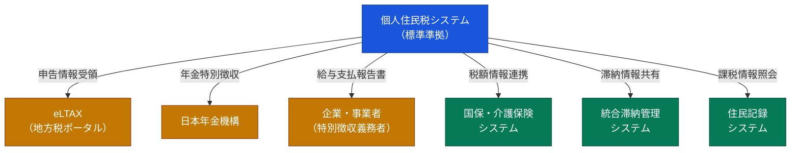

## はじめに：「業務別」で見えてくる移行格差

地方公共団体情報システムの標準化（以下、標準化）は、住民記録・税務・国保など17〜20業務を対象としています。デジタル庁・総務省の工程表では、2025〜2027年度にかけて自治体が順次標準準拠システムへ移行する計画です（出典: 総務省「地方公共団体の基幹業務等システムの統一・標準化」工程表, 2024年度版）。

しかし、すべての業務が同じペースで進んでいるわけではありません。住民記録や選挙人名簿管理と比べて、**個人住民税システムの移行完了自治体数は顕著に少ない**という実態があります。

なぜ個人住民税だけが遅れるのか。本記事では、デジタル庁・総務省・内閣府の一次資料をもとに、その構造的な要因を3つに整理して解説します。

---

## 個人住民税システムの全体像

まず、個人住民税システムの複雑さを図解で確認しましょう。

このように、個人住民税システムは**3種類の外部機関**（eLTAX・年金機構・企業）と**3種類の庁内システム**（国保・介護・住民記録）に接続しています。標準化対象の17業務の中で、これだけ多くの連携先を持つ業務は他にほとんどありません。

---

## 遅延の構造的要因1：要件数が突出して多い

総務省が公表している「業務別要件一覧（サンプル）」によれば、個人住民税業務の要件数は**236件**に達します（出典: 総務省「[業務別要件一覧サンプル（個人住民税）](https://www.soumu.go.jp/main_content/000301060.pdf)」）。

この数字を具体的に示すと、同資料で列挙されている介護保険との連携要件だけでも以下のようなものがあります。

- 要件29: 被保険者の課税状況・所得額を個人住民税情報から参照し、介護保険料を算定・登録できること
- 要件30: 特徴/普徴対象者の判定情報を、公的年金からの特別徴収対象判定のために個人住民税情報へ連携できること
- 要件31: 生活保護の受給状況について、保険料賦課情報に登録できること

これらの要件は、**介護保険システムとの間だけで複数の双方向データ連携**を定義しています。国保、統合滞納管理、住民記録との連携も同様の粒度で定義されており、Fit&Gap分析（現行システムと標準仕様の差異確認）に要する工数が他業務と比較にならないほど大きくなります。

総務省の手順書は移行のベンダ選定フェーズだけで約4〜6か月を見込んでいますが、個人住民税では連携先ごとに「受け入れ側のシステム改修が終わらずにリスケ」が発生するケースが報告されています（出典: デジタル庁「[先行団体の事例から得られた移行作業における留意事項](https://www.digital.go.jp/assets/contents/node/basic_page/field_ref_resources/c58162cb-92e5-4a43-9ad5-095b7c45100c/4730ad2c/20250502_policies_local_governments_outline_01.pdf)」2025年4月17日）。

---

## 遅延の構造的要因2：外部機関との連携テストがボトルネックになる

個人住民税システムは、自治体の庁内で完結しません。**eLTAX（地方税ポータルシステム）**・**日本年金機構**・**地方税電子化協議会**との電子的な接続が不可欠であり、これらの外部機関との連携テストが移行スケジュールの大きなボトルネックになります。

総務省の資料によれば、eLTAXは「インターネットを利用して地方税に係る手続を電子的に行うシステム」であり、複数団体への電子申告・電子納税を一括処理する基盤です（出典: デジタル庁「[地方税関係通知のデジタル化に係る現状と課題](https://www.digital.go.jp/assets/contents/node/basic_page/field_ref_resources/19256b0d-e0fb-4bd0-921a-9287189d7451/81d53800/20221214_meeting_multi-stakeholder-model-for-digital-transformation_outline_02.pdf)」2022年12月14日）。

また、個人住民税業務の要件一覧（総務省, 前掲）には以下のような年金連携要件が定められています。

- 要件58: **地方税電子化協議会から、年金特別徴収依頼処理結果情報を連携できること**
- 要件59: **地方税電子化協議会への年金特別徴収依頼情報、各種異動通知を連携できること**
- 要件60: 更正賦課処理より、他業務へ連携できること

年金特別徴収の仕組みでは、日本年金機構が年金受給者の住民税を年金から天引きし、市区町村へ納入します。この処理は**年間を通じて複数回**発生するため、連携テストを年間サイクルの特定時期にしか実施できないという制約があります。標準準拠システムへの切り替えを「年度途中」で行うと、特別徴収データの引き継ぎミスが市民に直接影響するため、**移行タイミングは年度切り替え（4月）前後に集中せざるを得ません**。

この「年に一度しかない安全な移行ウィンドウ」が、移行完了数が伸びない大きな構造的要因の一つです。

---

## 遅延の構造的要因3：自治体間の業務差異が大きく、標準化に時間を要した

税務業務は、自治体ごとの独自対応が最も多い領域の一つです。内閣府規制改革WGの資料によれば、「システムを標準化するためには業務の標準化が不可欠であり、**自治体間の税務業務の差異の分析が必要**」と明記されています（出典: 内閣府「[地方税システムの標準化・共通化](https://www5.cao.go.jp/keizai-shimon/kaigi/special/reform/wg6/191011/pdf/shiryou5.pdf)」2019年10月）。

同資料では、指定市（政令指定都市）が2018年度から研究会を設置し、個人住民税・法人住民税の標準化・共通化の範囲・方向性について検討を進めてきた経緯が記載されています。しかしながら、神戸市を中心とした指定市12市が参加した研究会であっても、税目ごとに必要なデータの差異が大きく、標準仕様の確定に時間を要しました。

この「仕様策定の遅れ」が、自治体側の調達開始を遅らせる連鎖を生んでいます。住民記録システムは標準仕様の策定が早かった一方、税務系（特に個人住民税）は仕様の安定化が後発になったため、ベンダの対応パッケージ開発も遅れました。自治体から見ると「選べる標準準拠パッケージがまだ少ない」状態が続き、調達競争が起きにくい状況も移行の遅れに拍車をかけています。

---

## 業務別の移行難易度：なぜ住民記録は進み、税務は遅れるのか

標準化対象業務の中で、移行が比較的スムーズに進む業務と難航する業務の差は何か。以下に主な業務を比較します。

| 業務 | 外部連携先 | 年度サイクル制約 | 移行難易度 |
|------|-----------|----------------|-----------|
| 住民記録 | マイナンバー制度、住基ネット | 低（通年移行可能） | 低〜中 |
| 選挙人名簿管理 | 少ない | 低 | 低 |
| 個人住民税 | eLTAX・年金機構・事業者・国保・介護・住民記録 | 高（4月前後に集中） | 高 |
| 国民健康保険 | 社会保険診療報酬支払基金・年金機構・住民記録 | 中 | 中〜高 |
| 介護保険 | 国保連合会・年金機構・住民記録・個人住民税 | 中 | 中〜高 |

個人住民税は「外部連携先の多さ」「年度サイクル制約の強さ」「要件数の多さ」のすべてにおいて最上位に位置します。

---

## 移行遅延が引き起こす実務上のリスク

個人住民税の移行が遅れると、自治体にはどのようなリスクが生じるでしょうか。

**1. 現行システムの保守延長コスト**

標準化の期限（令和7年度末）を超えて現行システムを維持する場合、ベンダとの保守契約を延長せざるを得ません。このコスト増は[移行コストが3〜5倍に膨らむ5つの原因](/articles/gc-migration-cost-causes)でも詳述していますが、個人住民税は接続先が多い分、保守範囲も広くなり、費用増加幅が大きくなります。

**2. 連携先の差分対応が積み重なる**

eLTAXの電子申告仕様や年金機構の連携仕様は定期的に改訂されます。現行システムを維持しながらこれらの改訂に対応し続けると、「標準仕様との差分」が年々拡大し、将来の移行コストが膨らむ悪循環に陥ります。

**3. 「移行困難システム」認定のリスク**

デジタル庁は移行に支障が生じた自治体の支援スキームとして「移行困難システム」認定制度を設けています。認定自治体の数はすでに[特定移行支援システム認定935自治体の完全一覧](/articles/gc-tokutei-iko-list)でまとめているとおり相当数に上っており、個人住民税を理由とするケースも含まれています。

---

## 自治体が今すぐとれる対策

移行を前進させるために、現場が今取り組める具体策を整理します。

### 1. 連携先ごとのテスト計画を先行して立てる

個人住民税では、eLTAX・年金機構・国保・介護保険の各連携先との「テスト受け入れスケジュール」が移行全体のクリティカルパスになります。ベンダ選定の完了を待たず、**連携テスト日程の確保交渉を先行**して始めることが効果的です。

デジタル庁の先行事例集は「住記ベンダが連携テストのスケジュールを提案していたが、受け入れ側のシステム改修が終わらずにリスケすることが当初に発生した」と報告しており、**リカバリ・リスケを前提としたバッファ設計**が不可欠です（出典: デジタル庁「先行団体の事例から得られた移行作業における留意事項」2025年4月17日, 前掲）。

### 2. 所管課（納税課）を移行プロジェクトの主体に巻き込む

標準化担当（情報政策課等）だけでなく、**納税課・市民税課の業務担当職員**をプロジェクトの主体として早期に参画させることが重要です。前掲のデジタル庁資料は「標準化担当ではテストの際に所管課の観点でシステム画面が正しく出力されているか把握できないため、所管課の協力が不可欠」と指摘しています。

個人住民税では、窓口運用の変更（例: 固定資産税課への照会が10分かかるため電卓計算で代替するなど）が移行後の業務フローに直結するため、所管課の検証なしには品質担保ができません。

### 3. 移行タイミングを「4月1日稼働」に一本化する

年金特別徴収の安全な引き継ぎを確保するためには、移行の本番稼働を**4月1日（新年度開始時）**に絞ることが現実的な選択です。そのためには、前年11〜12月時点での連携テスト完了、1〜2月での平行運用実施、3月での最終確認、という逆算スケジュールが必要になります。

---

## 2026年3月末以降の見通し

デジタル庁・総務省の工程表では、2026年度・2027年度にかけて「移行困難システムを有する地方公共団体の移行支援」フェーズが設けられています（出典: 総務省「基幹業務等システムの統一・標準化」工程表, 前掲）。個人住民税は、このフェーズの主要対象業務の一つになると見られます。

現在どの自治体が遅延リスクを抱えているかは、[遅延している自治体一覧2026年3月末](/articles/gc-delay-municipalities-2026)で詳しく確認できます。自団体の状況と照らし合わせながら、優先課題を整理することをお勧めします。

---

## まとめ

個人住民税の移行が最も遅れている理由は、単一の原因ではなく、以下の3つが重なった構造的な問題です。

1. **要件数が236件超**と突出しており、Fit&Gapに膨大な工数が必要
2. **eLTAX・年金機構などとの外部連携テスト**が移行スケジュールのボトルネックになり、年1回しかない安全な移行ウィンドウに集中せざるを得ない
3. **自治体間の業務差異が大きく**、標準仕様の確定自体が他業務より遅れ、ベンダのパッケージ開発も後発になった

これらの要因を理解した上で、連携テスト計画の先行、所管課の早期巻き込み、4月1日稼働への一本化という3つの対策を講じることが、遅延解消への現実的なアプローチです。

---

## 参考資料

- 総務省「業務別要件一覧サンプル（個人住民税）」
  https://www.soumu.go.jp/main_content/000301060.pdf

- デジタル庁「先行団体の事例から得られた移行作業における留意事項」（2025年4月17日）
  https://www.digital.go.jp/assets/contents/node/basic_page/field_ref_resources/c58162cb-92e5-4a43-9ad5-095b7c45100c/4730ad2c/20250502_policies_local_governments_outline_01.pdf

- デジタル庁「地方税関係通知のデジタル化に係る現状と課題」（2022年12月14日）
  https://www.digital.go.jp/assets/contents/node/basic_page/field_ref_resources/19256b0d-e0fb-4bd0-921a-9287189d7451/81d53800/20221214_meeting_multi-stakeholder-model-for-digital-transformation_outline_02.pdf

- 内閣府規制改革WG「地方税システムの標準化・共通化」（2019年10月）
  https://www5.cao.go.jp/keizai-shimon/kaigi/special/reform/wg6/191011/pdf/shiryou5.pdf

- 総務省「地方公共団体の基幹業務等システムの統一・標準化」工程表
  https://www.soumu.go.jp/main_content/000904550.pdf

- デジタル庁「ガバメントクラウド」公式ページ
  https://www.digital.go.jp/policies/gov-cloud/
