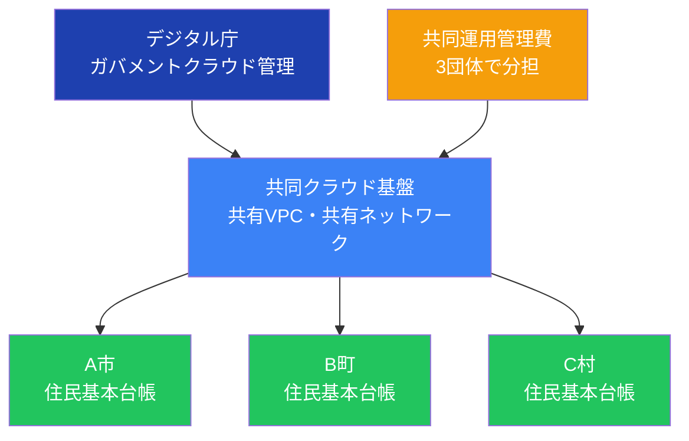

## はじめに：共同利用は「推奨」から「必須検討事項」へ

ガバメントクラウド（以下、ガバクラ）への移行において、デジタル庁は**共同利用方式を推奨**する姿勢を明確にしています。しかし実際の移行検討の現場では、「共同利用とは何か」「単独利用と比べて本当に安くなるのか」「どう進めればよいのか」という疑問が絶えません。

本記事では、内閣府・総務省・デジタル庁の一次資料と先行事例データをもとに、共同利用方式の仕組み・コスト削減効果・成功事例・導入時の注意点を網羅的に解説します。

---

## 共同利用方式とは何か

### 単独利用との違い

ガバクラの利用形態は大きく「**単独利用方式**」と「**共同利用方式**」の2種類に分かれます。

**単独利用方式**とは、1自治体（または1団体）が専用のAWSアカウント・OCI環境を持ち、そのシステム全体を自前で管理・運用する形態です。独立性が高く、他団体の影響を受けませんが、インフラコスト・運用管理コストをすべて1団体で負担します。

**共同利用方式**とは、複数の自治体が同一のクラウド基盤・システムをシェアする形態です。クラウド上の構成（VPC、ネットワーク設計、運用管理環境など）を複数団体で共有し、費用を分担します。

デジタル庁「GCAS（ガバメントクラウド・アクセス・サービス）ガイド」では、両方式を次のように整理しています。

> 「単独利用方式では、ガバメントクラウド利用組織の管理者が開発運用委託業者と共にシステムを管理するが、共同利用方式では、複数団体が運用管理環境を共有することで効率化を図る」（出典: デジタル庁「GCASガイド」https://guide.gcas.cloud.go.jp/）

### 共同利用の仕組みを図解で理解する

以下の図は、共同利用方式における費用分担と運用体制のイメージを示しています。

共同利用方式のポイントは「**スケールメリットによるコスト分担**」にあります。単独では丸ごと負担していたインフラ費・運用管理費を参加自治体数で割ることで、1団体あたりの費用を大幅に圧縮できます。

---

## コスト45%削減の実績：岡崎市・豊橋市の事例

### 自治体クラウドの先行事例が示す効果

内閣府の「先進事例の分析 ［自治体クラウド］」（内閣府規制改革推進会議資料）には、複数自治体の共同クラウド利用による削減効果が具体的な数値で示されています。

**岡崎市・豊橋市自治体クラウド（愛知県）**では、両市合計75万9千人規模での共同利用を実施し、5年間で**経費▲16億500万円（削減率▲45%）**を達成しました（出典: 内閣府「先進事例の分析 ［自治体クラウド］」https://www5.cao.go.jp/keizai-shimon/kaigi/special/reform/koukyou/02_cloud/pdf/bunseki_cloud.pdf）。

また**高石市・忠岡町・田尻町自治体クラウド（大阪府）**では、合計8万4千人規模での3団体共同利用により、5年間で**▲4億2,600万円（▲35%）**を削減しています（出典: 同上）。

| グループ名 | 参加団体 | 人口規模 | 5年間の削減効果 | 削減率 |
|-----------|---------|---------|--------------|------|
| 岡崎市・豊橋市自治体クラウド（愛知県） | 2団体 | 75万9千人 | ▲16億500万円 | ▲45% |
| 高石市・忠岡町・田尻町自治体クラウド（大阪府） | 3団体 | 8万4千人 | ▲4億2,600万円 | ▲35% |

これらの事例は自治体クラウド（ガバクラ前身期の共同利用）の実績ですが、現在のガバクラ共同利用方式においても同様のスケールメリットが期待できます。

---

## デジタル庁が共同利用を推奨する理由

### 投資対効果検証が示した課題

デジタル庁は令和5年度のガバクラ先行事業において、移行後のランニングコストが「従前を上回る団体」が複数確認されたと公表しています。その費用増加要因の中に「**単独利用による規模の経済が働かない構造**」が含まれていました。

この課題を受け、デジタル庁が令和6年9月に公表した「投資対効果検証 中間報告」では、費用削減の対策案として以下を明示しています。

> 「単独利用方式から共同利用方式への移行、運用管理環境の共同利用化、共通運用作業項目の拡大」（出典: デジタル庁「ガバメントクラウドの先行事業における投資対効果の検証 中間報告」2024年9月6日 https://www.digital.go.jp/assets/contents/node/basic_page/field_ref_resources/cadc83bd-9e0b-4c7c-883d-f09eeb314ecc/78a50e63/20240906_policies_local_governments_government-cloud-interim-report_outline_01.pdf）

デジタル庁が対策として「単独利用→共同利用への転換」を正式に提示していることは、共同利用方式が単なる選択肢ではなく、**コスト最適化の中核施策として位置づけられている**ことを示しています。

### ガバクラ先行事業での共同検証の評価

令和3年10月のガバクラ先行事業採択においても、共同提案は高く評価されています。デジタル庁は倉敷市・高松市・松山市の共同提案について次のように評価しています。

> 「3団体が同じアプリ製品を使用してリフト。共同検証実施により、構築・移行方法とアプリ種類が同一下における複数団体への展開モデルとなりうる」（出典: デジタル庁「ガバメントクラウド先行事業の採択結果について」2021年10月 https://www.digital.go.jp/assets/contents/node/information/field_ref_resources/8c953d48-271d-467e-8e4c-f7baa8ec018b/20211026_news_local_governments_01.pdf）

共同利用は採択段階からすでに国が促進してきた取り組みであり、ガバクラ政策の根幹に位置する考え方です。

---

## 共同利用方式がコストを削減できる3つのメカニズム

共同利用がなぜコストを下げるのか、仕組みを3つの観点から整理します。

### メカニズム1：インフラ費用の分担

クラウド基盤の固定的な費用（ネットワーク設計・セキュリティ構成・基盤となるクラウドリソース）は、参加団体数で割ることで1団体あたりの負担が軽減されます。

たとえばAWSのVPC設計・ネットワーク構成の初期コストが1,000万円であった場合、単独では1,000万円を1団体が負担しますが、10団体での共同利用であれば1団体あたり100万円に圧縮されます。

### メカニズム2：運用管理コストの共有

デジタル庁の資料が「費用増加要因の大きな項目」として指摘している「運用管理補助委託費」は、共同利用によって大幅に削減できます。

IAM権限管理・セキュリティグループ設定・ログ監視・バックアップ管理などのクラウド運用作業は、1団体でも10団体でも基本的な工数はさほど変わりません。複数団体でこれらの運用作業を共有することで、**1団体あたりの運用委託費が大幅に下がります**。

### メカニズム3：スケールによる割引の活用

AWSのリザーブドインスタンス（RI）やセービングプラン、OCIの長期割引は、一定のリソース使用量をコミットすることで適用されます。単独の小規模自治体では利用量が少なくコミット量が確保しにくいですが、複数団体が合算することで割引閾値を超えやすくなります。

デジタル庁も「長期継続割引（リザーブドインスタンスやセービングプランの適用）は費用逓減に効果的」と明示しており、共同利用はこの割引を最大化する構造的手段となります。

---

## 単独利用と共同利用の比較

| 比較項目 | 単独利用方式 | 共同利用方式 |
|---------|------------|------------|
| インフラコスト | 全額1団体負担 | 参加団体数で分担 |
| 運用管理費 | 全額1団体負担 | 共有化で分担 |
| 独立性・カスタマイズ | 高い（自由度大） | 低い（共通仕様に制約） |
| 意思決定スピード | 速い | 参加団体間の調整が必要 |
| コスト最適化のしやすさ | 単独で判断可能 | スケールメリットが活きる |
| 推奨対象 | 大規模・特殊要件の自治体 | 中小規模・標準業務の自治体 |

共同利用は**中小規模の自治体**が標準化された業務システム（住民基本台帳・国民健康保険・福祉など）をガバクラに移行する際に特に効果を発揮します。一方で、カスタム要件が多い大規模自治体や、他団体と足並みを揃えることが難しいケースでは、単独利用も選択肢となります。

---

## 共同利用を進める際の実務上の注意点

### 注意点1：「推奨」から先が難しい

デジタル庁は共同利用を「推奨」しつつも、地方公共団体標準準拠システムのガバクラ利用ガイドライン3.0版に対する意見照会の中では、「共同利用方式は推奨とあるが、実際には調整コストが高い」という現場の声も紹介されています（出典: デジタル庁「地方公共団体標準準拠システムのガバメントクラウドの利用について【3.0版】に対する意見照会の概要」2025年3月31日）。

複数団体が共同で調達・設計・移行を進めるには、参加団体間の**調整コスト（会議・合意形成・スケジュール調整）が発生**します。これを軽視すると、共同利用のメリットが帳消しになる場合もあります。

### 注意点2：通信回線費は共同利用だけでは解決しない

デジタル庁の中間報告が示すように、移行後コスト増の主要因の一つは「通信回線費」です。共同利用方式によってクラウド基盤費用や運用費は削減できますが、**庁内ネットワークからガバクラへの接続回線費は各団体が個別に負担する構造**であり、共同利用だけでは解消できません。

この点については、[移行コストが3〜5倍に膨らむ5つの原因](/articles/gc-migration-cost-causes)で詳しく解説しています。

### 注意点3：既存ベンダーとの契約調整が必要

共同利用への移行に際して、既存のシステムベンダー・保守ベンダーとの契約内容を見直す必要が生じます。共同利用向けに新たなパッケージを選定する場合、既存ベンダーとの契約解除・データ移行・検証作業が伴い、これがコスト増要因になることも珍しくありません。

コスト管理の全体観については、[自治体のためのFinOps入門](/articles/gc-finops-guide)で体系的に整理しています。

---

## 都道府県主導の共同利用推進

総務省は都道府県が管内市区町村の自治体クラウド導入を推進することを政策として位置づけてきました。総務省の指針では、都道府県が担う役割として以下を挙げています。

> 「プロジェクトを推進するための政策面でのアドバイス（支援策の紹介、団体間の調整等）の実施」「自治体クラウドの導入に向けた検討段階・業者調達段階等において必要となる経費の補助」「管内インフラの拡充、活用」（出典: 総務省「自治体クラウドの更なる展開について」https://www.soumu.go.jp/main_content/000281450.pdf）

都道府県が調整役として機能することで、個々の市区町村が抱える「調整コスト」を軽減できます。自治体の担当者は、自県の推進状況を確認し、都道府県主導の共同利用スキームに参加できないかを検討する価値があります。

---

## 自治体規模別の共同利用戦略

自治体の人口規模によって、共同利用の参加方法・期待効果は異なります。

### 人口10万人未満の小規模自治体

スケールメリットが最も大きいのはこの規模です。単独でガバクラ環境を構築・運用する体制・予算が十分でないケースが多く、同規模の複数団体での共同利用が最も効果的です。都道府県主導のスキームへの参加を最優先で検討すべきです。

### 人口10〜30万人規模の中規模自治体

インフラ面での体制はある程度確保できますが、運用管理費の効率化余地があります。近隣の同規模団体との2〜4団体での共同利用が現実的な選択肢です。特に同一パッケージ製品を使用している団体同士での共同移行は、倉敷市・高松市・松山市の事例が示すように効率が高いです。

### 人口30万人以上の大規模自治体・政令市

業務要件が複雑であり、単独利用が適している場合もあります。ただし運用管理環境（ログ監視・セキュリティ管理等）については、近隣団体と「共同利用の一部機能のみシェア」という選択的な共同利用も検討に値します。

---

## まとめ：共同利用は「コスト削減の最も確実な手段」

ガバクラへの移行でコストを削減するための手段は複数ありますが、その中でも共同利用方式は以下の点で他の手段と異なります。

- インフラ費・運用費という**構造的なコスト**を下げる
- スケールによる割引活用という**調達面の優位性**をもたらす
- デジタル庁が公式に対策として提示している**政策的な後ろ盾**がある

一方で、参加団体間の調整コスト・通信回線費の問題・既存ベンダーとの契約調整など、共同利用が解決できない課題も存在します。これらを踏まえた上で、単独利用・共同利用を比較検討することが、コスト最適化の第一歩となります。

コスト構造の全体像については、[コスト増大の構造的3要因](/articles/gc-cost-structural-factors)で詳しく解説しています。あわせてご参照ください。

---

## 参考資料

- デジタル庁「GCASガイド（ガバメントクラウド・アクセス・サービス）」 https://guide.gcas.cloud.go.jp/
- デジタル庁「ガバメントクラウドの先行事業における投資対効果の検証 中間報告（概要）」2024年9月6日 https://www.digital.go.jp/assets/contents/node/basic_page/field_ref_resources/cadc83bd-9e0b-4c7c-883d-f09eeb314ecc/78a50e63/20240906_policies_local_governments_government-cloud-interim-report_outline_01.pdf
- デジタル庁「ガバメントクラウド先行事業の採択結果について」2021年10月 https://www.digital.go.jp/assets/contents/node/information/field_ref_resources/8c953d48-271d-467e-8e4c-f7baa8ec018b/20211026_news_local_governments_01.pdf
- デジタル庁「地方公共団体標準準拠システムのガバメントクラウドの利用について【3.0版】意見照会概要」2025年3月31日 https://www.digital.go.jp/assets/contents/node/basic_page/field_ref_resources/c58162cb-92e5-4a43-9ad5-095b7c45100c/5ae8dbc1/20250331_policies_local_governments_outline_08.pdf
- 内閣府「先進事例の分析 ［自治体クラウド］」内閣府規制改革推進会議 https://www5.cao.go.jp/keizai-shimon/kaigi/special/reform/koukyou/02_cloud/pdf/bunseki_cloud.pdf
- 内閣府規制改革推進WG「費用増加要因分析」2024年11月25日 https://www5.cao.go.jp/keizai-shimon/kaigi/special/reform/wg6/20241125/pdf/shiryou3-2.pdf
- 総務省「自治体クラウドの更なる展開について」2018年10月 https://www.soumu.go.jp/main_content/000281450.pdf
