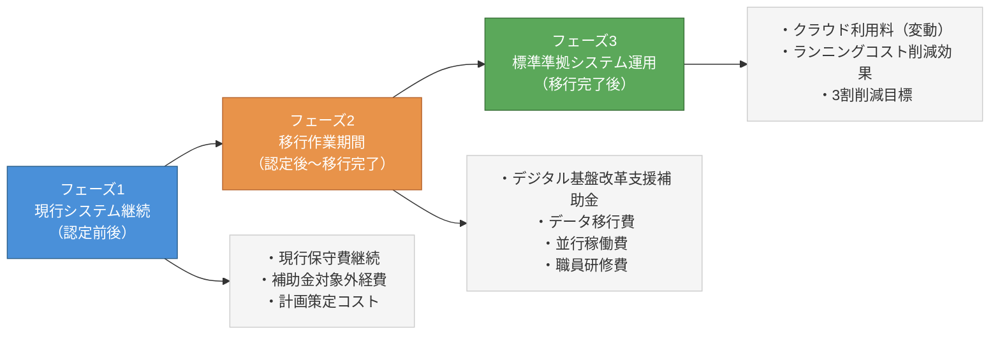

## はじめに：「特定移行支援」はコスト問題の解決策になるか

ガバメントクラウドへの移行期限（2025年度末）を超えて、いまなお標準準拠システムへの移行が完了していない自治体が相当数存在します。こうした団体を対象に新設されたのが「特定移行支援」制度です。

特定移行支援システムとは、メインフレームの構成による技術的複雑さ、代替事業者不在、事業者のリソースひっ迫など、自治体側の努力では解消しがたい事情により2026年度以降に移行が延びたシステムに対して、国が認定・支援を行う仕組みです（出典: 総務省「地方公共団体の基幹業務システムの統一・標準化に係る基本方針」2024年改定版）。

この制度が自治体の財政・コスト計画に与える影響は大きく、担当者が正確に把握しておかなければ予算積算を誤るリスクがあります。本記事では、特定移行支援の認定前・認定後・移行完了後という3つのフェーズにわたって、コストがどのように変化するかを整理します。

---

## 1. 特定移行支援とは何か：制度の基本構造

### 認定の要件

総務省の基本方針によると、特定移行支援システムとして認定されるための主要要件は以下の通りです。

- データ要件・連携要件に関する標準化基準に適合していること
- 制度所管省庁および地方公共団体が経過措置の必要性を認めていること
- 遅くとも令和10年度（2028年度）末までに機能標準化基準に適合する見通しがあること

また、経過措置の対象となった機能については、制度所管省庁において令和9年度（2027年度）末までに標準化基準上の取扱いの検討が行われます（出典: 総務省「地方公共団体の基幹業務システムの統一・標準化に係る基本方針」001053409.pdf）。

### 国の支援スタンス

デジタル庁・総務省・制度所管省庁は、特定移行支援システムについて自治体から状況・移行スケジュールを把握した上で、標準化基準を定める主務省令において所要の移行完了期限を設定し、「概ね5年以内に標準準拠システムへ移行できるよう積極的に支援する」とされています（出典: 総務省基本方針001053409.pdf）。

「概ね5年以内」とは、2026年度時点を起算とすれば最長2031年度頃を想定した期間です。この期間中のコスト負担と財政支援の関係が、担当者として最初に押さえるべき論点となります。

---

## 2. フェーズ別コスト変化の全体像

特定移行支援の文脈におけるコスト変化は、大きく3つのフェーズに分かれます。

各フェーズの詳細を以下で解説します。

---

## 3. フェーズ1：現行システム継続中のコスト構造

### 現行保守費は「二重負担」になる

特定移行支援として認定された後も、標準準拠システムへの移行が完了するまでは現行システムの保守・運用費が発生し続けます。これは、標準化完了後のシステムに係るクラウド利用料とは別途生じるため、移行期間中は実質的に「二重払い」の状態になります。

この二重負担は短くても1〜2年、長ければ数年にわたって継続する可能性があります。先行自治体の事例でも、移行期間中のコスト増が問題視されており、宇和島市・須坂市などで費用増加が確認されています（出典: 内閣府規制改革WG資料、2024年11月25日）。

### 計画策定にも費用が発生する

Fit&Gap分析、現行システム概要調査、移行計画作成といった作業フェーズは、外部委託費および職員の工数コストとして計上が必要です。総務省の標準化手順書では、「計画立案」「システム選定」「移行」の3フェーズそれぞれに作業項目が定義されており（出典: 総務省「地方公共団体情報システム標準化ガイドブック」000904545.pdf）、特定移行支援の対象であっても同様のプロセスを踏む必要があります。

---

## 4. フェーズ2：移行作業期間の財政支援とコスト

### デジタル基盤改革支援補助金の活用

移行作業に要する経費に対しては、国がデジタル基盤改革支援補助金による財政支援を行います。令和2年度第3次補正予算により地方公共団体情報システム機構（J-LIS）にデジタル基盤改革支援基金が造成されており、デジタル庁が情報システム整備方針に基づき総務省を通じて統括・監理を行います（出典: デジタル庁「地方公共団体の基幹業務システムの統一・標準化に係る基本方針」20230908_meeting_local_governments_outline_06.pdf）。

補助金の対象となる主な経費は以下の通りです。

| 経費区分 | 内容 |
|---------|------|
| データ移行費 | 現行システムから標準準拠システムへのデータ移行に要する費用 |
| 接続費 | ガバメントクラウド接続に要する費用 |
| 文字の標準化 | 文字コード変換・標準化対応費用 |
| 契約変更等の追加的経費 | 現行ベンダーとの契約変更に伴う費用 |

特定移行支援システムについてはガバメントクラウド環境での標準準拠システム構築が前提となるため、補助金の適用範囲と条件の正確な把握が予算計画の核心となります。補助金の詳細手続きはJ-LISが定める事務処理要領等によって規定されます（出典: 総務省000857218.pdf）。

### 並行稼働・データ移行の費用は過小評価されやすい

特定移行支援の対象となるシステムは、メインフレーム構成など技術的に複雑なケースが多く、データ移行費は標準的なシステムと比較して高額になる傾向があります。また、移行完了までの「並行稼働期間」——現行システムと新システムを同時に動かす期間——の費用も見落とされがちです。

この並行稼働費は補助金対象外になる場合があるため、自費負担として予算計上しておく必要があります。

### 移行支援期間の終了後も補助金は継続されるか

当初の「移行支援期間」（令和5〜7年度）は終了していますが、特定移行支援として認定されたシステムに対しては継続的な財政支援が想定されています。ただし、当初期間外の補助金適用については毎年度の予算措置に依存するため、将来の補助金継続を確実なものとして計画に織り込むことは慎重に行う必要があります。

---

## 5. フェーズ3：移行完了後のコスト変化

### ガバメントクラウドのランニングコスト特性

標準準拠システムへの移行が完了すると、従来のオンプレミスやデータセンター型の保守費から、ガバメントクラウド（AWS・OCI）の利用料ベースの課金体系に切り替わります。

ガバメントクラウドの利用料は変動費型であり、システム利用量・データ容量・処理件数によって月次で変動します。この変動費特性は、従来の固定費型契約に慣れた自治体担当者にとって予算管理上の難しさとなります。

### 「3割削減」目標と現実のギャップ

国の目標は「現行システム運用経費等の3割削減」ですが、デジタル庁の中間報告では先行事業参加自治体の中にコスト増加団体が確認されています。コスト増の要因として、カスタマイズ排除による業務変更コスト、ベンダー数の増加による調整費、FinOps（クラウド費用最適化）の不備などが挙げられています。

特定移行支援の認定を受けた自治体は、移行完了時点が2028〜2031年度頃となるため、先行自治体の事例から学ぶ時間的余裕があります。この「後発の優位性」を活かしてコスト最適化計画を事前に策定することが重要です。

---

## 6. 特定移行支援を受ける自治体が取るべきコスト管理アクション

### アクション1：現行保守費の契約見直し

特定移行支援として認定されたことは、現行ベンダーとの交渉において「移行期限が明確になった」ことを意味します。この機会を活用して、移行完了までの現行保守費の削減交渉を行うことが有効です。

### アクション2：補助金申請の準備を前倒しで行う

補助金申請にはJ-LISへの申請手続きと書類準備が必要です。移行工程を確定させ、補助金の申請タイミングと補助対象経費の範囲を早期に確認しておくことで、申請漏れを防ぐことができます。

### アクション3：ガバメントクラウド移行後のコスト試算

移行完了後のランニングコストについては、AWS・OCIそれぞれの料金体系をもとに試算を行います。GCInsightの[コスト効果ページ（/costs）](/costs)では、先行自治体のデータをもとにしたコスト比較情報を参照できます。また、クラウド別ベンダーの料金体系については[クラウド別ベンダーページ（/cloud）](/cloud)を参照してください。

### アクション4：FinOpsの早期導入

クラウド費用の最適化手法であるFinOpsは、移行後のコストを継続的に管理するための有効な手段です。詳しくは関連記事「[自治体のためのFinOps入門](/articles/gc-finops-guide)」で解説しています。

---

## 7. 移行遅延とコスト増のリスク

特定移行支援として認定されても、「概ね5年以内」という期限を超えた場合のペナルティや財政支援の打ち切りリスクに注意が必要です。

移行が長引けば長引くほど、以下のコストリスクが累積します。

1. **現行保守費の長期継続**: ベンダー保守費は年々値上がりする傾向にあります
2. **補助金適用期間の終了**: 財政措置は恒久的ではなく、毎年度の予算措置に依存します
3. **技術負債の蓄積**: 移行を遅らせるほど、現行システムの陳腐化が進み移行コストが増大します
4. **人材・リソース不足の深刻化**: 2026〜2028年度はシステム移行作業が全国的に集中するため、SIerのリソース確保コストが上昇します

特定移行支援という「猶予」は、移行完了への確実なコミットメントと裏表の関係にあります。担当者は「認定された」ことを安心材料とするのではなく、確実な移行完了に向けたスケジュール管理と予算確保を継続する必要があります。

移行遅延リスクの詳細は、[移行遅延リスク一覧（/risks）](/risks)でも確認できます。また、特定移行支援システムに認定された935自治体の詳細は、関連記事「[特定移行支援システム認定935自治体の完全一覧](/articles/gc-tokutei-iko-list)」を参照してください。

---

## まとめ：特定移行支援はコストを「先送り」するものではない

特定移行支援は、移行が困難な事情を抱えた自治体に対する国の積極的な支援制度です。しかし、それはコストの問題を解消するものではなく、移行までの期間を「管理しながらコストを支払い続ける期間」として捉える必要があります。

本記事で整理したコスト変化の3フェーズをもとに、以下の点を庁内で共有しておくことを推奨します。

- 現行保守費の継続期間と金額の見通し
- 補助金申請のスケジュールと補助対象外経費の自費負担額
- 移行完了後のランニングコスト試算と3割削減目標の達成見込み

「特定移行支援に認定された」という事実は、予算計画の出発点であって、終着点ではありません。担当者として、移行完了までの全期間を見通したコスト管理体制の構築が求められます。

---

## 参考資料

- 総務省「地方公共団体の基幹業務システムの統一・標準化に係る基本方針」（2024年改定）
  https://www.soumu.go.jp/main_content/001053409.pdf

- 総務省「地方公共団体情報システム標準化ガイドブック」
  https://www.soumu.go.jp/main_content/000904545.pdf

- デジタル庁「地方公共団体の基幹業務システムの統一・標準化に係る基本方針（情報システム整備方針）」
  https://www.digital.go.jp/assets/contents/node/basic_page/field_ref_resources/87bea441-45fa-485a-b891-2866ffecd780/0e358314/20230908_meeting_local_governments_outline_06.pdf

- 総務省「地方公共団体情報システムの標準化・共通化に係る補助金事務処理要領」
  https://www.soumu.go.jp/main_content/000857218.pdf

- デジタル庁「地方公共団体の基幹業務システムの統一・標準化に関する検討会 資料」（2024年12月19日）
  https://www.digital.go.jp/assets/contents/node/basic_page/field_ref_resources/66264825-2451-43ce-8da5-1adce44c72b8/24cc7ebe/20241219_meeting_local_governments_outline_04.pdf
