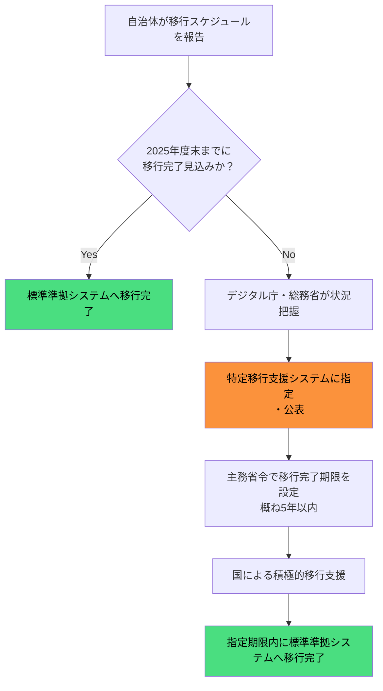

## はじめに：935自治体が「特定移行支援」に認定された意味

2026年3月31日（2025年度末）が、自治体の基幹業務システム標準化の第一期限でした。しかしデジタル庁が2026年2月27日に公表した最新データによれば、全国1,788団体（都道府県・市区町村）のうち **935団体（52.3%）** が「特定移行支援システム」を少なくとも1つ保有していることが明らかになっています。

「特定移行支援システム」とは、標準化対象の全34,592システムのうち、2025年度末の期限内に標準準拠システムへの移行が完了しない見込みのシステムを指します。令和7年12月末時点で **8,956システム（25.9%）** がこのカテゴリに分類されています（出典: デジタル庁「地方公共団体の基幹業務等システムの統一・標準化の取組状況」2026年2月27日公表）。

これは自治体の「移行失敗」ではありません。制度として国が用意した正規のルートです。ただし、認定後も移行義務は継続し、主務省令による期限内（概ね5年以内）に完了させる必要があります。本記事では、特定移行支援システムの定義・認定基準・期限設計・コスト影響を、デジタル庁・総務省の一次資料に基づいて解説します。

---

## 特定移行支援システムとは何か

### 制度上の位置付け

「特定移行支援システム」は、地方公共団体情報システム標準化基本方針（2024年12月改定）において明確に定義された制度上の区分です。

通常の移行支援期間（令和5年4月〜令和8年3月）内に標準準拠システムへの移行が完了しない見込みのシステムのうち、デジタル庁・総務省・制度所管省庁が把握・公表するものを指します。「把握・公表」が重要で、国が正式に移行遅延を認知した上で、積極的な支援対象として指定するものです。

「移行困難システム」との違いを整理しておきます。

| 区分 | 定義 | 期限 | 国の関与 |
|------|------|------|---------|
| 特定移行支援システム | 期限内未完了見込み・国が把握・公表 | 主務省令で個別設定（概ね5年以内） | デジタル庁・総務省が積極支援 |
| 移行困難システム | 技術的理由等で移行自体が困難 | 経過措置として令和10年度（2028年度）末まで | 制度所管省庁が個別検討 |

特定移行支援システムは「遅延しているが移行可能なシステム」、移行困難システムは「技術的制約等で移行そのものが困難なシステム」という違いがあります。

### 認定のプロセス

デジタル庁・総務省・制度所管省庁は、自治体から把握した当該システムの状況および移行スケジュールも踏まえて、標準化基準を定める主務省令において所要の移行完了の期限を設定することとしており、「概ね5年以内に標準準拠システムへ移行できるよう積極的に支援する」とされています（出典: 地方公共団体情報システム標準化基本方針 2024年12月改定版）。

---

## 最新データ：935団体・8,956システムの内訳

### 急増する特定移行支援システムの推移

デジタル庁の公表データを時系列で追うと、特定移行支援システムの件数が急増していることがわかります。

| 公表時点 | システム数 | 全体に占める割合 |
|---------|-----------|----------------|
| 令和7年6月27日 | 3,279システム（推計） | 約9.5% |
| 令和7年7月末 | 3,770システム | 10.9% |
| 令和7年12月末 | 8,956システム | 25.9% |

令和7年7月末から12月末の半年間で、3,770システムから8,956システムへと **＋5,186システム（約2.4倍）** に急増しています。

デジタル庁はこの主な増加要因として、「移行作業が本格化する中で、移行作業やその直後の運用に想定以上のSEリソースが必要であることが判明したこと等により、事業者による移行スケジュールの大幅な見直しが行われたため」と説明しています（出典: デジタル庁「地方公共団体の基幹業務等システムの統一・標準化の取組状況」2026年2月27日公表）。

### 935団体の現状

令和7年12月末時点の最新データでは、以下の状況です。

- **特定移行支援システムを保有する団体**: 1,788団体中935団体（52.3%）
- **令和8年1月末時点の移行完了**: 13,283システム（38.4%）が標準準拠システムへの移行を完了

すでに移行を完了したシステムが38.4%ある一方で、まだ移行が終わっていない団体が半数を超えるという二極化が進んでいます。

---

## なぜ半数超の自治体が特定移行支援に

### SEリソース不足が主因

最大の要因は、ベンダーのSE（システムエンジニア）リソースの不足です。デジタル庁の公表資料では、「移行作業やその直後の運用に想定以上のSEリソースが必要であることが判明した」とされており、事業者が移行スケジュールを大幅に見直したことが件数急増につながっています。

全国1,741市区町村が同時期に標準準拠システムへの移行を進めるため、対応可能なベンダーのSEリソースが需要を大幅に超過しています。特に2025年度（令和7年度）後半に移行作業が集中したため、リソース不足が顕在化しました。

### メインフレームの複雑な移行作業

一部の自治体では、現行システムがメインフレームにより構成されており、「システムの全容把握からデータ移行をはじめとした標準準拠システムへの移行完了まで」に他システムより長期間を要することが指摘されています（出典: 地方公共団体情報システム標準化基本方針改定案 2024年12月19日）。

### 一部機能の経過措置適用

標準化基準への完全適合が困難な機能については、経過措置として以下の条件を満たす場合に限り、一時的な非適合が認められます。

1. データ要件・連携要件に関する標準化基準には適合していること
2. 制度所管省庁および地方公共団体が経過措置の必要性を認めること
3. 遅くとも **令和10年度（2028年度）末まで** に機能標準化基準に適合すること

（出典: 地方公共団体情報システム標準化基本方針 2024年12月19日改定案）

---

## 特定移行支援とコストへの影響

特定移行支援システムを抱える自治体は、追加的なコスト負担が発生する可能性があります。詳細な分析については[特定移行支援でコストはどう変わるか](/costs)をご参照ください。

主要なコスト増加要因として以下が挙げられます。

**移行期間の延長による費用**
- 現行システムの運用保守コストが継続
- ガバメントクラウドへの移行費用（一時的な二重コスト発生）
- 移行作業のSE費用（需要超過による単価上昇）

**システム間連携の複雑化**
- 移行完了したシステムと未完了システムの混在期間が長期化
- 連携インターフェースの維持・管理コスト

なお、国はクラウド利活用推進のための財政支援措置として、デジタル基盤改革支援補助金を用意しています。特定移行支援システムの認定を受けた自治体もこの補助金の対象となります。

---

## 特定移行支援 vs 「遅延」の違い

一般的な報道では「移行遅延」として取り上げられることも多いですが、特定移行支援システムの認定を受けた自治体が、制度上「違反」や「失敗」の状態にあるわけではありません。

[特定移行支援と「遅延」の違い](/risks)で詳述していますが、制度上の整理は以下の通りです。

- **特定移行支援システム**: 国が把握・公表し、積極支援を行うと宣言したシステム。主務省令で新たな期限が設定される正規のルート
- **期限超過（違反状態）**: 主務省令で設定された新期限も超過した場合。この状態には至っていない

935団体が特定移行支援システムを保有しているという事実は、日本の自治体標準化が「失敗した」ことを意味するのではなく、国・自治体・ベンダーが現実的なスケジュールを再設計しているプロセスにあることを示しています。

---

## 自治体DX担当者が確認すべき点

### 自団体のシステムが認定されているかの確認方法

デジタル庁は、特定移行支援システムを把握・公表する体制を整備しています。自団体の基幹業務システムが特定移行支援システムに認定されているかどうかは、デジタル庁の公表資料（「地方公共団体の基幹業務等システムの統一・標準化の取組状況」）を参照するか、担当ベンダーに確認することで把握できます。

### 認定後に取るべきアクション

特定移行支援システムの認定を受けた場合、以下のアクションが求められます。

1. **移行完了期限の確認**: 主務省令で設定された新たな期限を把握する
2. **移行計画の再策定**: 新期限に向けた現実的なスケジュールを策定
3. **財政支援の申請**: デジタル基盤改革支援補助金等の活用を検討
4. **都道府県との連携**: 標準化リエゾンを通じた広域調整・情報収集

### 議会・首長への説明のポイント

特定移行支援システムの認定は、制度上の正規ルートであることを議会・首長に正確に伝えることが重要です。「遅延=失敗」という誤解を避けるため、以下の点を説明資料に盛り込むことを推奨します。

- 全国52.3%の自治体が同様の状況にあること
- 国が積極支援を表明していること
- 主務省令に基づく新たな期限が設定されていること
- 補助金等の財政支援措置が継続されること

---

## まとめ

特定移行支援システムの現状を整理します。

| 指標 | 数値 | 出典 |
|------|------|------|
| 対象団体数 | 935団体（全1,788団体の52.3%） | デジタル庁 2026年2月27日公表 |
| 対象システム数 | 8,956システム（全34,592の25.9%） | デジタル庁 2026年2月27日公表 |
| 移行完了済（令和8年1月末） | 13,283システム（38.4%） | デジタル庁 2026年2月27日公表 |
| 経過措置の最終期限 | 令和10年度（2028年度）末 | 標準化基本方針 2024年12月改定 |
| 特定移行支援の目標期限 | 認定から概ね5年以内 | 標準化基本方針 2024年12月改定 |

制度上の区分を正しく理解し、自団体の状況を客観的に把握したうえで、都道府県・国との連携を強化することが、担当者に求められる対応です。

GCInsightでは[全国の移行進捗状況](/risks)および[クラウド・ベンダー別の詳細情報](/cloud)を継続的に更新しています。自団体の位置づけを把握する際のリファレンスとしてご活用ください。

---

## 参考資料

1. デジタル庁「地方公共団体の基幹業務等システムの統一・標準化の取組状況」（2026年2月27日公表）
   - https://www.digital.go.jp/assets/contents/node/basic_page/field_ref_resources/c58162cb-92e5-4a43-9ad5-095b7c45100c/0d69c7bf/20260227_policies_local_governments_doc_1.pdf

2. 地方公共団体情報システム標準化基本方針（2024年12月19日改定）
   - https://www.digital.go.jp/assets/contents/node/basic_page/field_ref_resources/66264825-2451-43ce-8da5-1adce44c72b8/efe6dac5/20241219_meeting_local_governments_outline_02.pdf

3. 総務省「地方公共団体情報システム標準化基本方針」（令和6年度改定版）
   - https://www.soumu.go.jp/main_content/001053408.pdf

4. 内閣府経済財政諮問会議・規制改革WG資料「特定移行支援システムの把握・公表」
   - https://www5.cao.go.jp/keizai-shimon/kaigi/special/reform/wg6/2025/shiryou3-2.pdf

5. デジタル庁「標準化基本方針改定案（2024年12月19日）主な改定事項」
   - https://www.digital.go.jp/assets/contents/node/basic_page/field_ref_resources/66264825-2451-43ce-8da5-1adce44c72b8/24cc7ebe/20241219_meeting_local_governments_outline_04.pdf
