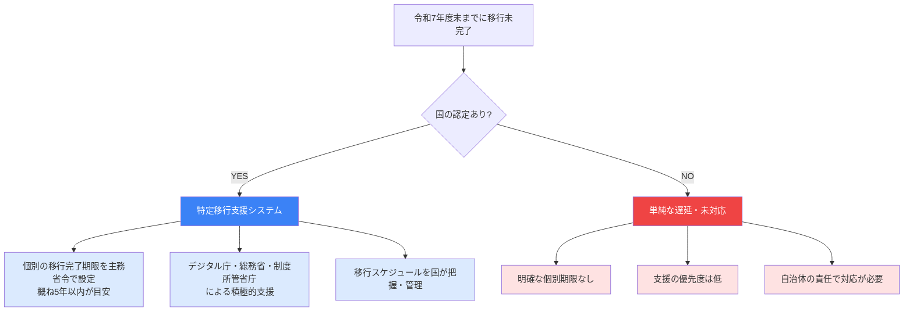

## はじめに：「遅延」と「特定移行支援」は別の概念

2026年3月末（令和7年度末）の標準準拠システムへの移行期限が迫るなか、「まだ移行が終わっていない」自治体を一律に「遅延」と捉える報道が増えています。しかし、移行が令和7年度末までに完了しない自治体には、少なくとも2つの異なる状態があります。

1. **特定移行支援システムを保有する自治体** — 国が制度的に認定し、個別の移行完了期限と積極的支援が付与されているケース
2. **単純な遅延自治体** — 認定を受けないまま期限に間に合わないケース

この2つを同じ「遅延」として扱うと、自治体の実態評価や今後のロードマップ策定において大きな誤りを招きます。本記事では、デジタル庁・総務省の一次資料をもとに、両者の制度上の違いを正確に整理します。

---

## 標準化の期限と「移行支援期間」の位置づけ

まず前提となる制度的な時間軸を確認します。

標準化基本方針（令和6年12月改定）によれば、地方公共団体は標準準拠システムへの移行について、原則として**令和7年度（2025年度）末までに移行することを目指す**とされています。

> 「地方公共団体は、令和５年（2023年）３月末時点での標準化対象事務に係る基幹業務システムを……令和７年度（2025年度）末までに移行することを目指す。」
>
> （出典: デジタル庁「地方公共団体情報システム標準化基本方針改定案」2024年12月、https://www.digital.go.jp/assets/contents/node/basic_page/field_ref_resources/66264825-2451-43ce-8da5-1adce44c72b8/24cc7ebe/20241219_meeting_local_governments_outline_04.pdf）

また、令和5年（2023年）4月から令和8年（2026年）3月までが**「移行支援期間」**として位置づけられており、国はこの期間、必要な支援を積極的に行うことを明示しています。「移行支援期間」は令和8年3月末（2026年3月末）で終了しますが、それは「全ての自治体が完了する期限」とは意味が異なります。

---

## 特定移行支援システムとは何か

特定移行支援システムとは、**技術的・事業者側の制約によって令和7年度末までの移行が極めて困難と認められるシステム**に対し、国が個別に認定・管理する制度上のカテゴリです。

標準化基本方針（令和6年12月改定）では、次のように規定されています。

> 「特定移行支援システムについて、デジタル庁、総務省及び制度所管省庁は、自治体から把握した当該システムの状況及び移行スケジュールも踏まえて、標準化基準を定める主務省令において、所要の移行完了の期限を設定することとし、**概ね５年以内に標準準拠システムへ移行できるよう積極的に支援する**。」
>
> （出典: 総務省「地方公共団体情報システム標準化基本方針」令和6年12月、https://www.soumu.go.jp/main_content/001053409.pdf）

「概ね5年以内」は令和7年度末（2025年度末）を起点とすると、最長で**令和12年度末（2030年度末）ごろ**が目安となります。ただし期限は主務省令で個別に設定されるため、システムごとに異なります。

---

## 制度比較：特定移行支援 vs. 遅延

以下の図で2つの状態の制度上の違いを整理します。

| 比較軸 | 特定移行支援システム | 単純な遅延・未対応 |
|---|---|---|
| 国の認定 | あり（制度上のカテゴリ） | なし |
| 移行完了期限 | 主務省令で個別設定（概ね5年以内） | 原則として令和7年度末が期限 |
| 国の支援体制 | デジタル庁・総務省・制度所管省庁が積極関与 | 標準的な支援のみ |
| 移行スケジュール管理 | 国が個別把握・管理 | 自治体側の責任 |
| 法的位置づけ | 主務省令に根拠 | 基本方針上の目標未達 |

---

## 特定移行支援システムが認定される主な理由

特定移行支援システムとなる典型的な要因は、2023年9月時点の基本方針改定案などで明示されています。

> 「現行システムがメインフレームにより構成されているケース、または事業者の撤退により代替事業者が見つからない場合など、2026年度以降の移行とならざるを得ないシステム」

（出典: デジタル庁「地方公共団体情報システム標準化基本方針改定案」2023年9月、https://www.digital.go.jp/assets/contents/node/basic_page/field_ref_resources/87bea441-45fa-485a-b891-2866ffecd780/0e358314/20230908_meeting_local_governments_outline_06.pdf）

具体的には以下が主な認定要因とされています。

- **メインフレーム構成**: クラウド移行に多大な再開発工数が必要なシステム
- **ベンダー撤退・供給不足**: 当該システムを移行できる事業者が市場に存在しない、または極めて少ない状態
- **業務量・規模の問題**: 超大規模自治体で移行に物理的な時間を要するケース
- **データ移行の技術的困難**: レガシーデータ形式による移行前処理に長期間が必要なケース

これらは自治体の努力不足ではなく、**構造的・外部的な要因**によるものです。

---

## 2026年3月時点の規模感

GCInsightが集計するデータによれば、2025年12月末時点で標準化対象の34,592システムのうち、**8,956システム（25.9%）が特定移行支援システム**として分類されています。自治体数では**935団体（約52%）が少なくとも1つの特定移行支援システムを保有**しており、過半数の自治体に何らかの移行未完了システムが存在するという現実があります。

この数字を「遅延率52%」と読むのは誤りです。935自治体のうち多くは、国が制度的に認定し個別の支援・期限管理のもとに置かれている自治体です。標準化の評価には「遅延か否か」だけでなく、「特定移行支援の対象か否か」という軸が不可欠です。

関連する自治体の詳細な一覧は、[特定移行支援システム認定935自治体の完全一覧](/articles/gc-tokutei-iko-list)でご確認いただけます。

---

## 「経過措置」とは何が違うのか

混同しやすい概念として**「経過措置」**もあります。

経過措置は、標準仕様書の改定に伴い、**一定期間だけ旧仕様への適合を猶予する措置**です。特定の機能について「令和9年度（2027年度）末までに所要の検討を行う」などの形で、制度所管省庁が期限を設定します。これはシステム全体の移行時期に関するものではなく、あくまで**特定機能の標準化基準への適合時期を延ばす**ものです。

| 概念 | 対象 | 設定主体 | 目的 |
|---|---|---|---|
| 特定移行支援 | システム全体の移行完了時期 | デジタル庁・総務省・制度所管省庁（主務省令） | 移行困難システムへの個別支援 |
| 経過措置 | 特定機能の標準化基準適合時期 | 制度所管省庁（主務省令） | 制度改正対応の猶予 |
| 遅延 | 期限内に完了しなかった事実 | （認定なし） | 移行未完了の状態 |

---

## 自治体担当者が確認すべきポイント

自治体のDX担当者・情報システム担当者が現状を正確に把握するために、以下のチェックポイントを確認することを推奨します。

**1. 自庁のシステムは特定移行支援システムとして認定されているか**
デジタル庁・総務省への申告・把握のプロセスを経て認定されます。認定されていない場合、令和7年度末が依然として移行完了の目標です。

**2. 特定移行支援システムの個別移行完了期限を把握しているか**
主務省令で設定される期限はシステムごとに異なります。「概ね5年以内」という目安のみで管理せず、担当省庁から正確な期限を確認することが必要です。

**3. 「移行支援期間終了後」の支援体制を確認しているか**
令和8年3月末で移行支援期間が終了しても、特定移行支援システムについては国の積極的支援が継続します。ただし支援内容・体制は移行支援期間中とは異なる可能性があります。

自治体の移行コストへの影響については、[特定移行支援でコストはどう変わるか](/articles/gc-tokutei-cost-impact)で詳しく解説しています。

---

## まとめ

「特定移行支援システム」と「遅延」は制度上、明確に異なる概念です。主要な違いを再整理します。

- **特定移行支援システム**: 国が認定し、主務省令で個別の移行完了期限を設定。デジタル庁・総務省が積極的に支援する。期限は概ね令和12年度末（2030年度末）を目安とする
- **単純な遅延**: 国の認定なしに令和7年度末までの移行が完了しない状態。制度上の明確な個別期限なし

935自治体・8,956システムという数字は、日本の自治体システム移行の構造的難しさを示すものですが、その大部分は「無秩序な遅れ」ではなく「国が把握・管理する計画的な段階移行」として位置づけられています。

自治体担当者は、自庁のシステムがどのカテゴリに属するかを正確に把握したうえで、適切な予算計画・議会説明・ベンダー交渉を進めることが重要です。

---

## 参考資料

- デジタル庁「地方公共団体情報システム標準化基本方針改定案」（2024年12月）
  https://www.digital.go.jp/assets/contents/node/basic_page/field_ref_resources/66264825-2451-43ce-8da5-1adce44c72b8/24cc7ebe/20241219_meeting_local_governments_outline_04.pdf
- 総務省「地方公共団体情報システム標準化基本方針」（令和6年12月）
  https://www.soumu.go.jp/main_content/001053409.pdf
- デジタル庁「地方公共団体情報システム標準化基本方針改定案」（2023年9月）
  https://www.digital.go.jp/assets/contents/node/basic_page/field_ref_resources/87bea441-45fa-485a-b891-2866ffecd780/0e358314/20230908_meeting_local_governments_outline_06.pdf
- 総務省「自治体情報システムの標準化・共通化について（令和5年度版）」
  https://www.soumu.go.jp/main_content/000966924.pdf
- 日経クロステック「難航する自治体システム標準化、『特定移行支援』で国の移行支援を5年延長」
  https://xtech.nikkei.com/atcl/nxt/keyword/18/00002/010900275/
